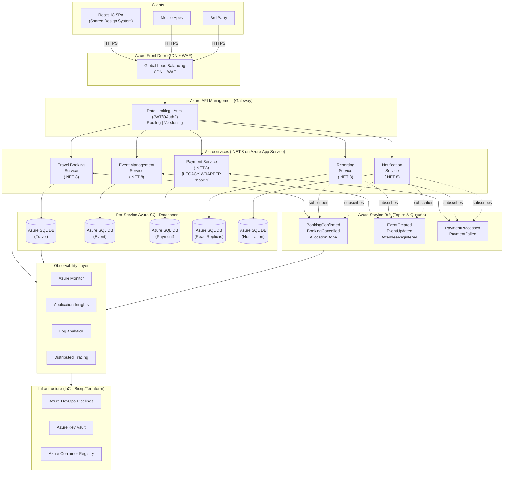
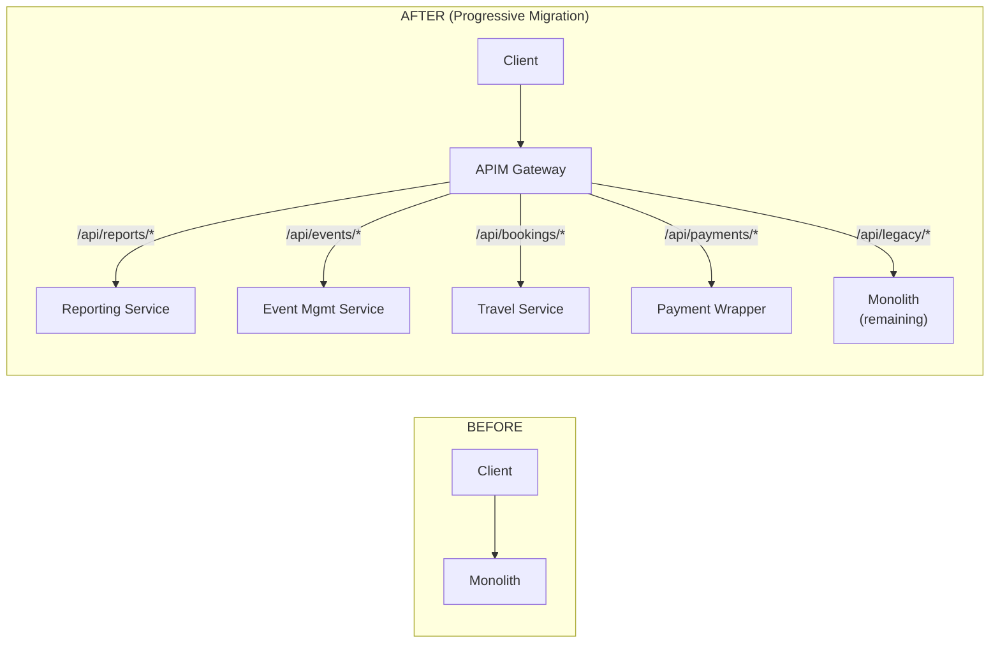
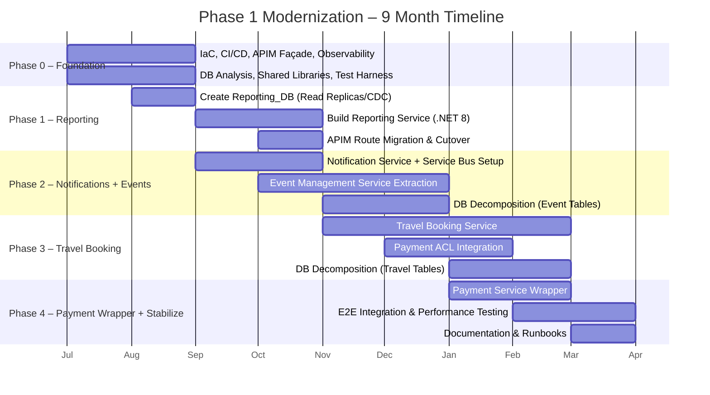
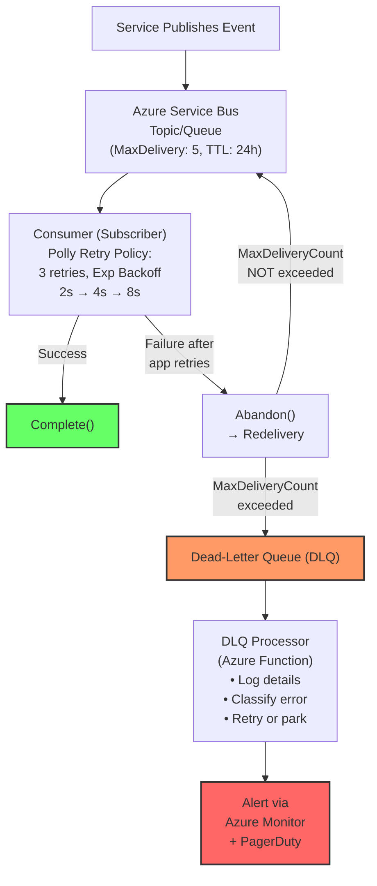
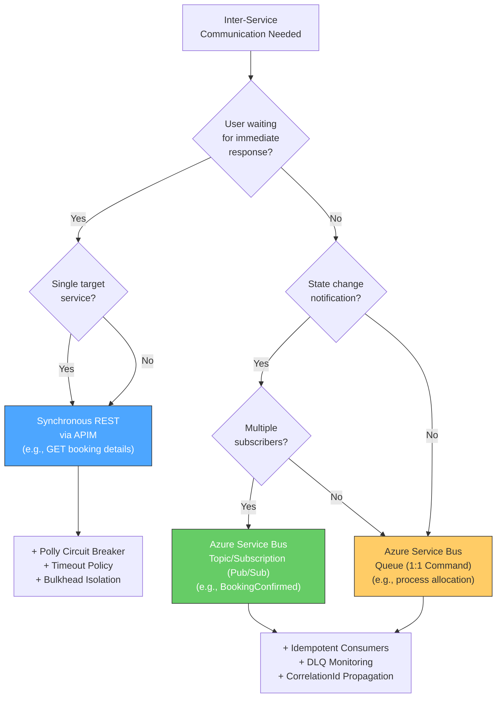
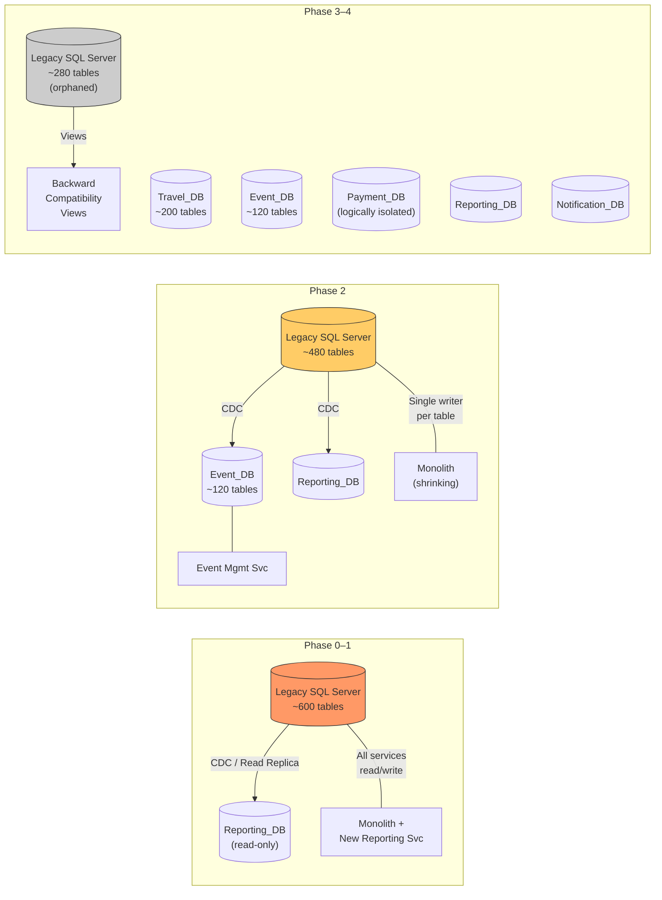
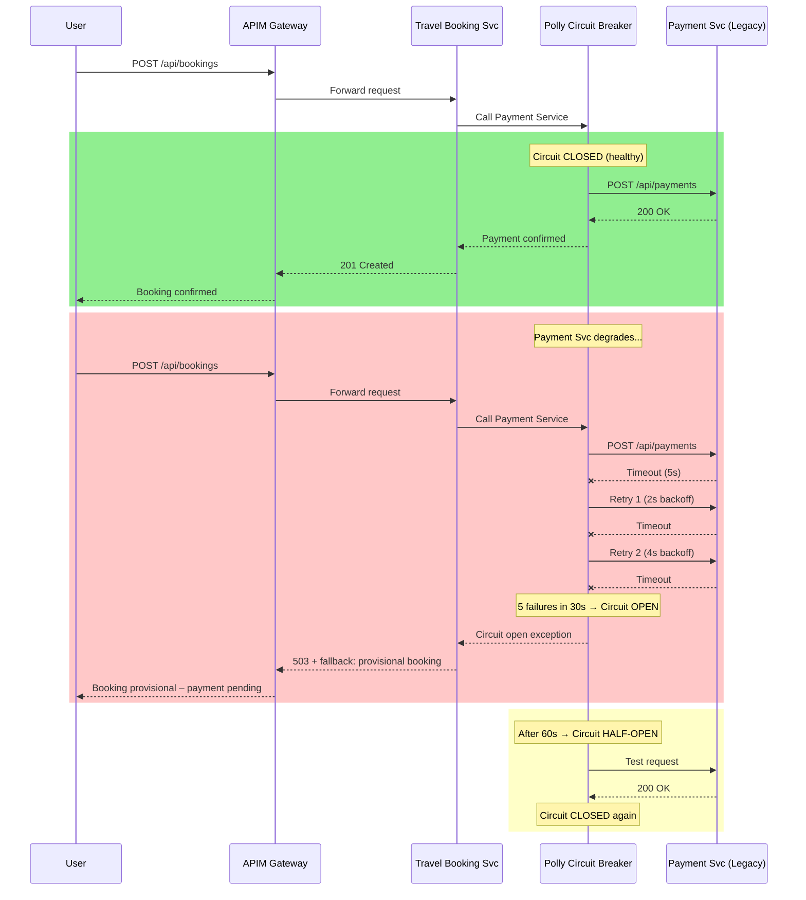
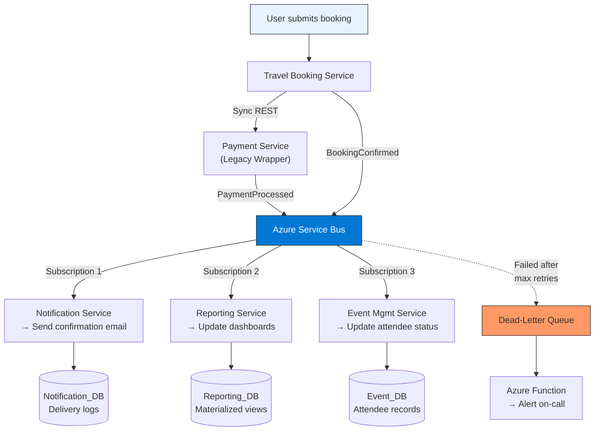

### 1. High-Level Architecture Diagram

---

### 2. Strangler Fig Pattern – Before & After

---

### 3. Migration Phases (Gantt-style Timeline)

---

### 4. Retry and Dead-Letter Handling Flow

---

### 5. Communication Model Decision Flow

---

### 6. Phased Database Decomposition

---

### 7. Risk & Failure – Cascading Failure (Circuit Breaker)

---

### 8. Event Flow Example – Booking Confirmation

