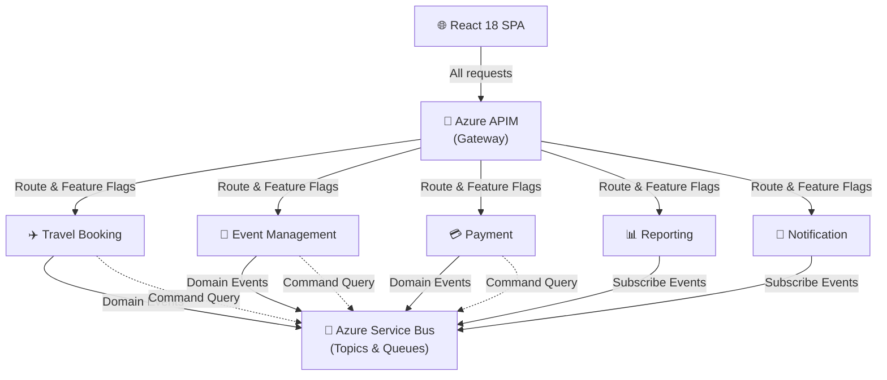

# Travel Booking

**Legacy .NET Framework monolith → Azure microservices modernization**

Travel Booking is the architectural blueprint and reference implementation for migrating a monolithic .NET Framework application (~40,000 users, ~600-table database) to a cloud-native, event-driven microservices architecture on Azure using .NET 8.

> **Status:** Phase 1 development — May 2026 to January 2027. Service scaffolding and shared libraries are in place; business logic implementation is underway.

---

## Architecture Overview

The modernization follows the **Strangler Fig** pattern with **Azure API Management (APIM)** as the facade, progressively routing traffic from the legacy monolith to five bounded-context microservices.



### Core Architectural Patterns

| Pattern | Implementation |
|---|---|
| **Strangler Fig** | APIM routes traffic to new services or legacy, with feature-flag-controlled progressive rollout |
| **Transactional Outbox** | Domain state + outbox message written in a single SQL transaction; MassTransit publishes to Service Bus |
| **Saga Orchestration** | MassTransit State Machine in Travel Booking for multi-step booking workflows with compensation |
| **CQRS** | Write services (Travel, Event, Payment) separated from read-optimized Reporting Service |
| **Anti-Corruption Layer** | Payment Service wraps the legacy payment system in Phase 1 |
| **Event-Driven Messaging** | Service Bus Topics for pub/sub, Queues for point-to-point commands |

---

## Microservices

| Service | Responsibility | Key Patterns |
|---|---|---|
| **Travel Booking** | Search, itinerary management, booking lifecycle | Saga orchestrator, transactional outbox |
| **Event Management** | Event CRUD, scheduling, attendee registration | Domain events, pub/sub |
| **Payment** | Payment processing, refunds, reconciliation | Anti-corruption layer (legacy wrapper in Phase 1) |
| **Reporting** | Dashboards, analytics, data exports | Read-only materialized views from domain events |
| **Notification** | Email, SMS, push notifications | Event subscriber, template-based delivery |

Each service follows **Clean Architecture**: `API` → `Application` → `Domain` → `Infrastructure`, with its own Azure SQL database.

---

## Tech Stack

### Backend

| Component | Technology |
|---|---|
| Runtime | .NET 9 / ASP.NET Core 9 |
| ORM | Entity Framework Core 9 |
| Messaging | MassTransit 8.3 + Azure Service Bus |
| CQRS/Mediator | MediatR 12.4 |
| Resilience | Polly 8.5 (circuit breakers, retries) |
| Validation | FluentValidation 11.11 |
| Mapping | Mapster 7.4 |
| Logging | Serilog 9.0 → Application Insights |
| Auth | JWT Bearer + API Key |
| API Docs | Swashbuckle/Swagger 7.3 |
| Testing | xUnit 2.9 · Moq 4.20 · FluentAssertions 7.2 · Coverlet 6.0 |

### Frontend

| Component | Technology |
|---|---|
| Framework | React 18.3 + TypeScript 5.7 |
| Build | Vite 6.0 |
| Routing | TanStack Router 1.92 |
| Server State | TanStack Query 5.62 |
| Client State | Zustand 5.0 |
| Forms | React Hook Form 7.54 + Zod 3.24 |
| Styling | TailwindCSS 4.0 + Radix UI |
| Real-time | SignalR 8.0 |
| Charts | Tremor 3.18 |
| i18n | i18next 24.2 |
| Testing | Vitest 3.0 · Testing Library 16.1 · Playwright 1.49 |

### Azure Infrastructure

Azure App Service · Azure SQL Database · Azure Service Bus · Azure API Management · Azure Front Door (CDN + WAF) · Application Insights · Azure Key Vault · Azure DevOps CI/CD

---

## Project Structure

```
TravelBooking/
├── src/
│   ├── Common/                            # Shared NuGet libraries
│   │   ├── TravelBooking.Common.Events/       #   Base IntegrationEvent, event contracts
│   │   ├── TravelBooking.Common.Logging/      #   Serilog config, correlation ID middleware
│   │   ├── TravelBooking.Common.HealthChecks/ #   SQL + Service Bus health check extensions
│   │   └── TravelBooking.Common.Security/     #   JWT Bearer + API Key auth handlers
│   │
│   ├── Services/                          # Microservices (Clean Architecture per service)
│   │   ├── TravelBooking/
│   │   │   ├── TravelBooking.API/         #   REST endpoints, middleware
│   │   │   ├── TravelBooking.Application/ #   MediatR handlers, DTOs, validators
│   │   │   ├── TravelBooking.Domain/      #   Entities, value objects, domain events
│   │   │   ├── TravelBooking.Infrastructure/ # EF Core, repositories, outbox
│   │   │   └── TravelBooking.Tests/       #   Unit + integration tests
│   │   ├── EventManagement/               #   (same 5-project structure)
│   │   ├── Payment/                       #   (same 5-project structure)
│   │   ├── Reporting/                     #   (same 5-project structure)
│   │   └── Notification/                  #   (same 5-project structure)
│   │
│   └── Frontend/                          # React 18 SPA
│       ├── src/
│       │   ├── app/                       #   Layout, router setup
│       │   ├── features/                  #   Feature-sliced modules (bookings, events, etc.)
│       │   ├── shared/                    #   Reusable components, hooks, utilities
│       │   └── mocks/                     #   MSW mock server for testing
│       └── e2e/                           #   Playwright E2E tests
│
├── Directory.Build.props                  # Shared .NET build settings
├── Directory.Packages.props               # Central NuGet version management
├── TravelBooking.slnx                         # Solution file
│
├── Technical_Assessment_Solution_Final_Version4.md   # Latest architecture design
├── TechSpec.md                            # Detailed technical specifications
├── PRD-Frontend-React18-SPA.md            # Frontend PRD (51 user stories)
├── Diagrams.md                            # Mermaid diagram sources
└── CLAUDE.md                              # AI agent configuration
```

---

## Getting Started

### Prerequisites

- .NET SDK 9.0+
- Node.js 18+
- SQL Server 2019+ or Azure SQL Database
- Azure Service Bus namespace (or local emulator)

### Backend

```bash
# Restore and build all services
dotnet restore TravelBooking.slnx
dotnet build TravelBooking.slnx

# Run tests
dotnet test TravelBooking.slnx

# Run a specific service
cd src/Services/TravelBooking/TravelBooking.API
dotnet run
```

Each service requires configuration in `appsettings.json`:

| Key | Purpose |
|---|---|
| `ConnectionStrings:DefaultConnection` | Azure SQL connection string |
| `AzureServiceBus:ConnectionString` | Service Bus connection |
| `Authentication:Authority` | OAuth2/OIDC authority (Azure AD) |
| `Authentication:SigningKey` | JWT signing key |
| `ApplicationInsights:InstrumentationKey` | Telemetry key |

### Frontend

```bash
cd src/Frontend

npm install          # Install dependencies
npm run dev          # Dev server at http://localhost:5173
npm run build        # Production build → dist/
npm run test         # Vitest (watch mode)
npm run test:e2e     # Playwright E2E tests
npm run lint         # ESLint + Prettier check
```

---

## Testing Strategy

| Layer | Tool | Scope |
|---|---|---|
| Backend Unit | xUnit + Moq + FluentAssertions | Domain logic, handlers, validators |
| Backend Integration | WebApplicationFactory | API endpoints, EF Core + in-memory DB |
| Code Coverage | Coverlet | Target: ≥80% on domain/application layers |
| Frontend Unit | Vitest + Testing Library | Components, hooks, utilities |
| Frontend E2E | Playwright | Full user journeys (booking, events, payments, dashboards, notifications) |
| API Mocking | MSW (Mock Service Worker) | Frontend tests against mocked backend |

---

## Observability

- **Structured Logging** — Serilog with JSON output to Azure Application Insights
- **Correlation IDs** — Propagated across all services via `CorrelationIdMiddleware`
- **Distributed Tracing** — W3C Trace Context (`traceparent` header) across HTTP and Service Bus
- **Health Checks** — `/health` endpoint per service (SQL connectivity, Service Bus reachability)
- **Metrics & Dashboards** — Azure Monitor for response time, error rate, throughput
- **Alerting** — Dead-letter queue monitoring, circuit breaker state changes, health check failures

---

## Migration Timeline (Phase 1)

| Milestone | Period | Focus |
|---|---|---|
| **MS1 — Foundation** | May–Jun 2026 | IaC, CI/CD, APIM facade, observability, shared libraries |
| **MS2 — Reporting** | Jul–Aug 2026 | First service extraction (read-only, lowest risk) |
| **MS3 — Events + Notifications** | Aug–Oct 2026 | Event-driven messaging backbone |
| **MS4 — Travel Booking** | Nov 2026–Jan 2027 | Saga orchestrator, core booking workflow |
| **MS5 — Payment + Stabilization** | Dec 2026–Jan 2027 | Payment isolation, end-to-end testing, hardening |

**Team:** 5 backend engineers + frontend and DevOps resources.

---

## Documentation

| Document | Description |
|---|---|
| [Technical Assessment Solution (Latest)](Technical_Assessment_Solution_Final_Version4.md) | Complete architecture design with diagrams and ADRs |
| [Technical Specification](TechSpec.md) | Event payloads, error handling, retry strategies, API contracts |
| [Frontend PRD](PRD-Frontend-React18-SPA.md) | 51 user stories, acceptance criteria, UX specifications |
| [Architecture Diagrams](Diagrams.md) | Mermaid source for all architecture diagrams |
| [Original Assessment Brief](Technical%20Assessment%20-%20Technical%20Lead%20%E2%80%93%20Azure%20Microservices.md) | Requirements, constraints, and evaluation criteria |

---

## License

*Not yet specified.*
