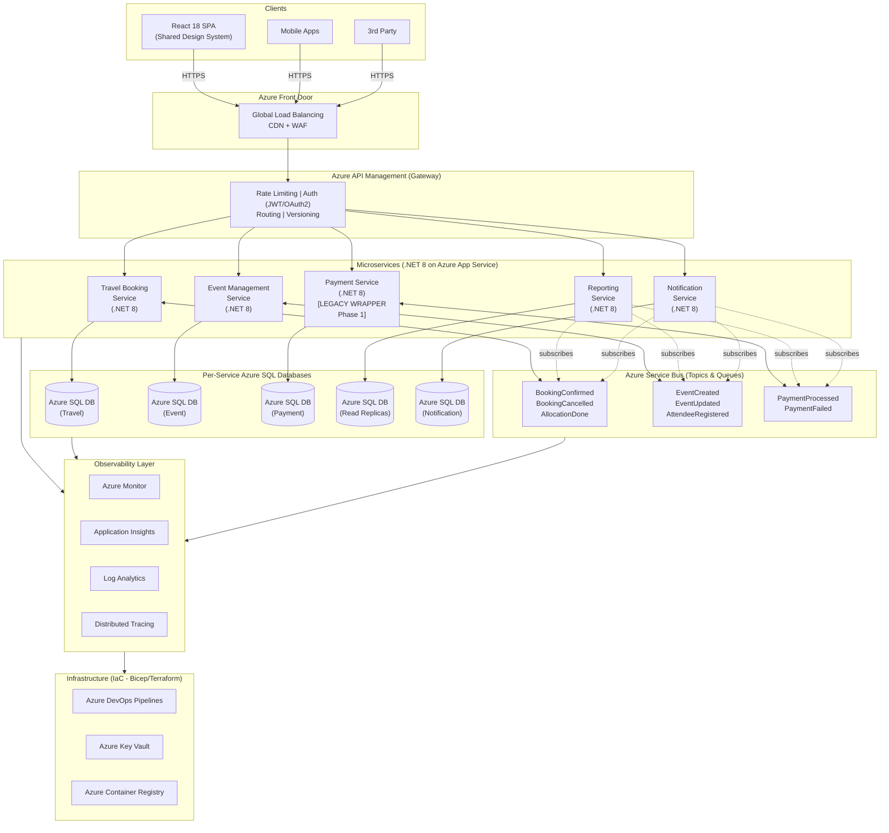
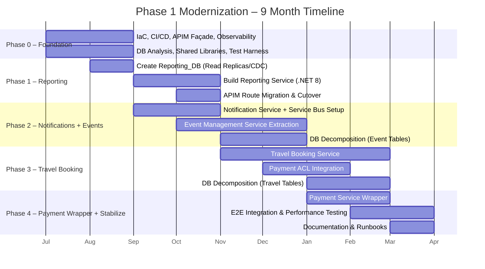
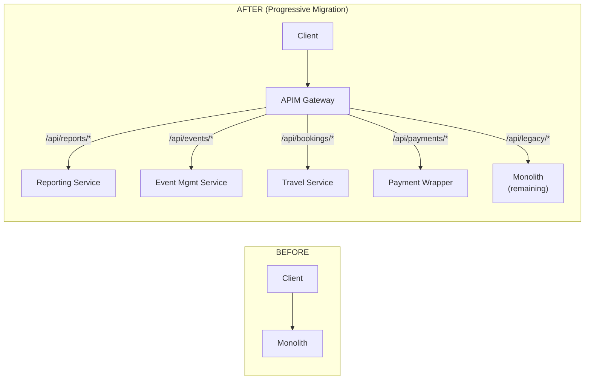
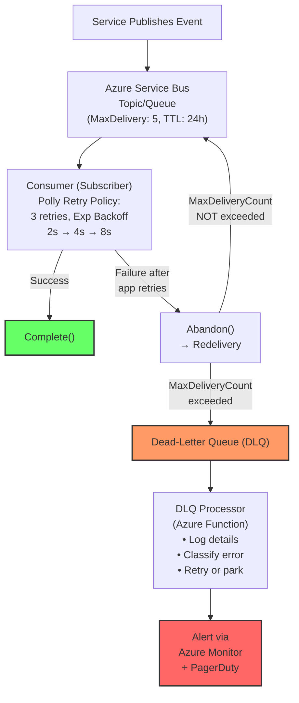

# Technical Assessment: Technical Lead – Azure Microservices

## Complete Solution

I've analyzed the assessment document in detail. Below is a comprehensive solution addressing all 6 deliverables.

---

## 1. Target Architecture Overview

### High-Level Architecture Diagram



### Proposed Service Boundaries (Bounded Contexts)

| Bounded Context | Service | Responsibility | Data Ownership |
|---|---|---|---|
| **Travel** | Travel Booking Service | Search, booking, itinerary, allocation algorithms, supplier integration | `Travel_DB` – bookings, itineraries, allocations, suppliers |
| **Events** | Event Management Service | Event creation, scheduling, attendee registration, workforce assignment | `Event_DB` – events, schedules, attendees, workforce |
| **Payments** | Payment Service | Payment processing, refunds, reconciliation, digital wallets | `Payment_DB` – transactions, ledger, payment methods *(Legacy wrapper in Phase 1)* |
| **Reporting** | Reporting Service | Dashboards, analytics, data aggregation, exports | `Reporting_DB` – materialized views, read replicas, denormalized data |
| **Communications** | Notification Service | Email, SMS, push notifications, centralized comms templates | `Notification_DB` – templates, delivery logs, preferences |

### Communication Model (Sync vs Async)

| Pattern | When Used | Technology | Examples |
|---|---|---|---|
| **Synchronous (Request/Reply)** | User-facing queries needing immediate response; reads | REST over HTTPS via API Gateway | Get booking details, search events, fetch reports |
| **Asynchronous (Event-Driven)** | Cross-service state changes; eventual consistency acceptable | Azure Service Bus (Topics/Subscriptions) | BookingConfirmed → triggers notification; PaymentProcessed → updates booking status |
| **Async Command (Queue)** | Reliable 1:1 task processing | Azure Service Bus (Queues) | Process allocation, generate report |

### How Azure Components Are Used

| Azure Component | Purpose |
|---|---|
| **Azure App Service** | Hosts each .NET 8 microservice (per-service deployment slots for blue/green) |
| **Azure SQL Database** | Per-service database, elastic pools for cost optimization during transition |
| **Azure Service Bus** | Event-driven messaging backbone – Topics for pub/sub, Queues for commands |
| **Azure API Management** | API Gateway – routing, auth, rate limiting, versioning, legacy façade |
| **Azure Front Door** | Global load balancing, CDN for React SPA, WAF protection |
| **Application Insights** | Distributed tracing, metrics, live monitoring per service |
| **Azure Key Vault** | Secrets management, connection strings, certificates |
| **Azure DevOps / GitHub Actions** | CI/CD pipelines, IaC deployment (Bicep) |
| **Azure Monitor + Log Analytics** | Centralized logging, alerting, dashboards |

---

## 2. Rationale

### Why These Service Boundaries?

These boundaries are derived from **Domain-Driven Design (DDD)** analysis of the business domain:

1. **Natural domain separation**: Travel, Events, Payments, Reporting, and Communications are distinct business capabilities with different domain experts, change cadences, and regulatory requirements. Payment processing has PCI-DSS compliance requirements that benefit from isolation. Reporting has fundamentally different read patterns (heavy aggregation, no writes) versus transactional services.

2. **Team-aligned ownership**: With 5 backend engineers, we need boundaries that allow 1-2 engineers to own a service end-to-end. Five services map well to five engineers, each becoming the domain expert for their context while pairing across boundaries during integration.

3. **Independent deployability**: Each bounded context can be developed, tested, and deployed independently. The Payment service being wrapped in Phase 1 (constraint: cannot change) doesn't block Travel or Event modernization.

4. **Data sovereignty**: Each service owns its data, preventing the monolithic database from becoming a distributed bottleneck. The ~600 tables naturally cluster around these domains when analyzed by foreign key relationships and access patterns.

### Why This Communication Model?

1. **Sync for reads, Async for writes across boundaries**: User-facing queries (search a booking, view an event) demand low latency → synchronous REST. Cross-service state propagation (booking confirmed → send notification → update report) is inherently asynchronous and benefits from decoupling.

2. **Resilience**: If the Notification Service is temporarily down, a `BookingConfirmed` event remains in the Service Bus topic. The booking flow isn't blocked. This is critical for the **zero-downtime** constraint.

3. **Azure Service Bus fit**: Topics/Subscriptions provide pub/sub fan-out (one event, multiple subscribers). Built-in dead-letter queues, retry policies, and sessions align with enterprise reliability requirements. Unlike Event Hubs (optimized for high-throughput streaming), Service Bus provides transactional messaging semantics that match our domain event patterns.

4. **Avoiding distributed monolith**: By defaulting to async communication between services, we prevent temporal coupling. Services don't need to know about each other's availability at runtime.

---

## 3. Migration Strategy (Sequenced Plan)

### Phased Migration Plan



#### Phase 0: Foundation (Months 1–2)

**Goal**: Establish infrastructure, CI/CD, observability, and the Strangler Fig façade – *zero business logic migration*.

| Activity | Detail |
|---|---|
| Set up IaC (Bicep/Terraform) | Azure resource provisioning: App Services, SQL Databases, Service Bus, APIM, Key Vault |
| CI/CD Pipelines | Automated build, test, deploy per service. Blue/green deployment slots on App Service |
| API Gateway (APIM) façade | All traffic routes through APIM → existing monolith. **This is the Strangler Fig entry point** |
| Observability baseline | Application Insights on monolith + all new services. Distributed tracing with `CorrelationId` header propagation |
| Shared libraries | NuGet packages: common error handling, logging, event contracts, health checks |
| Database analysis | Map ~600 tables to bounded contexts. Identify shared tables, foreign key dependencies, write/read ratios |
| Automated test foundation | Integration test harness, contract testing framework (Pact), API test suite against monolith as baseline |

#### Phase 1: Reporting Service Extraction (Months 2–4)

**Goal**: Extract the lowest-risk, read-heavy service first. Validate the Strangler pattern end-to-end.

| Activity | Detail |
|---|---|
| Create `Reporting_DB` | Read replicas / materialized views. ETL or Change Data Capture from legacy SQL Server |
| Build Reporting Service (.NET 8) | REST APIs for dashboards, exports, analytics |
| APIM route migration | `/api/reports/*` routes switch from monolith → Reporting Service. Feature flag controlled |
| Legacy database views | Reporting Service reads from `Reporting_DB`; legacy monolith continues writing to original tables |
| Validate & cut over | Shadow traffic comparison → full cutover → decommission reporting code in monolith |

**Why Reporting first?** Read-only, no transactional risk, no payment dependency, validates the full pipeline.

#### Phase 2: Notification Service + Event Management (Months 3–6)

**Goal**: Introduce event-driven architecture with the first pub/sub patterns.

| Activity | Detail |
|---|---|
| Notification Service | New .NET 8 service. Subscribes to domain events, sends emails/SMS/push. Own `Notification_DB` |
| Azure Service Bus setup | Topics: `booking-events`, `event-events`, `payment-events`. Subscriptions per consumer service |
| Event Management Service | Extract event CRUD, scheduling, attendee registration. Own `Event_DB` |
| Dual-write during transition | Monolith publishes events to Service Bus while still writing to legacy DB. New service subscribes. **Idempotent consumers** |
| APIM route migration | `/api/events/*` routes progressively switch. Feature flags per endpoint |
| Database decomposition | Extract event-related tables (~120 tables) from monolith DB to `Event_DB`. Use database views for backward compatibility |

#### Phase 3: Travel Booking Service (Months 5–8)

**Goal**: Migrate the core domain – most complex, highest business value.

| Activity | Detail |
|---|---|
| Travel Booking Service | Search, booking workflows, itinerary management, allocation algorithms. Own `Travel_DB` |
| Integration with Payment (legacy wrapper) | Travel Service calls Payment via an **Anti-Corruption Layer** – a thin .NET 8 API wrapping the legacy payment module |
| Event publishing | `BookingConfirmed`, `BookingCancelled`, `AllocationCompleted` → Service Bus |
| Database decomposition | Extract travel tables (~200 tables). Maintain sync with legacy DB via CDC during transition |
| APIM route migration | `/api/bookings/*`, `/api/travel/*` progressively switch |

#### Phase 4: Payment Wrapper + Stabilization (Months 7–9)

**Goal**: Wrap (not rewrite) Payment for service isolation. Stabilize entire platform.

| Activity | Detail |
|---|---|
| Payment Service wrapper | Thin .NET 8 App Service that proxies to legacy payment logic. **No business logic changes** (constraint) |
| Own `Payment_DB` | Logical isolation – may still be same physical SQL Server instance but separate schema/connection |
| End-to-end integration testing | Full user journey tests across all services |
| Performance testing | Load test at ~40,000 user scale. Identify bottlenecks |
| Legacy monolith decommission plan | Identify remaining code in monolith. Plan Phase 2 roadmap |
| Documentation & runbooks | Operational runbooks, incident response, architecture decision records |

### How the Strangler Fig Pattern Is Applied



1. **APIM as the façade**: From Day 1, all client traffic goes through Azure API Management. Initially, 100% is proxied to the monolith.
2. **Progressive route migration**: As each service is ready, APIM routing rules redirect specific URL paths to the new service. Feature flags (Azure App Configuration) control rollout percentage.
3. **Shadow/canary traffic**: Before full cutover, shadow traffic compares monolith and new service responses. Canary deployments route 5% → 25% → 100%.
4. **Monolith shrinks**: After each phase, the corresponding code/tables in the monolith are deprecated. The monolith never grows—only shrinks.

### Backward Compatibility

| Strategy | Detail |
|---|---|
| **API versioning via APIM** | `Accept-Version` header or URL path versioning (`/v1/`, `/v2/`). Old clients continue hitting v1 routes |
| **Database views as contracts** | When tables move to a new service DB, leave database views in the legacy DB pointing to the same data (via linked server or CDC sync) during the transition window |
| **Anti-Corruption Layer** | New services don't directly consume legacy schemas. An ACL translates between legacy data models and new domain models |
| **Event schema evolution** | Use CloudEvents envelope with schema version. Consumers handle multiple versions. Avro/JSON Schema Registry in Service Bus metadata |

### Zero Downtime Strategy

| Technique | Implementation |
|---|---|
| **Blue/Green deployments** | Azure App Service deployment slots. Swap staging → production with zero downtime |
| **Feature flags** | Azure App Configuration. Toggle new routes on/off without redeployment |
| **Database migrations without locks** | Online schema changes (Azure SQL online index rebuild). Expand-and-contract pattern: add new column → backfill → migrate reads → drop old column |
| **Service Bus buffering** | During service restarts, messages queue in Service Bus. No event loss |
| **Health checks + circuit breakers** | APIM health probes route away from unhealthy instances. Polly circuit breaker in service-to-service calls |
| **Canary releases** | Gradual traffic shift (5% → 25% → 100%) with automatic rollback on error rate spike |

### Shared Database During Transition

| Phase | Strategy |
|---|---|
| **Phase 0–1** | All services still share the legacy SQL Server. New `Reporting_DB` is a read replica. No schema changes to legacy |
| **Phase 2** | Change Data Capture (CDC) syncs event tables from legacy DB → `Event_DB`. Both databases are temporarily consistent. Monolith writes to legacy; Event Service writes to `Event_DB` |
| **Phase 3** | Same CDC pattern for Travel tables. Legacy DB views point to new DBs for backward compatibility |
| **Phase 4** | Payment tables logically isolated. Legacy DB retains only orphaned/unclaimed tables for future phases |
| **Key rule** | **Each table has exactly one writer**. Multiple readers are fine (via CDC/views). This prevents split-brain data corruption |

---

## 4. Event-Driven Design

### 5 Core Domain Events

#### 1. BookingConfirmed

```json
{
  "eventId": "uuid-v4",
  "eventType": "BookingConfirmed",
  "eventVersion": "1.0",
  "timestamp": "2025-07-15T10:30:00Z",
  "correlationId": "uuid-v4",
  "source": "travel-booking-service",
  "data": {
    "bookingId": "BK-2025-001234",
    "userId": "USR-98765",
    "travelType": "flight",
    "departureDate": "2025-09-01",
    "returnDate": "2025-09-10",
    "destination": "HCM",
    "totalAmount": 1250.00,
    "currency": "USD",
    "passengers": [
      { "name": "John Doe", "passportNumber": "XX123456" }
    ],
    "paymentReference": "PAY-2025-005678"
  }
}
```

**Subscribers**: Notification Service (send confirmation email), Reporting Service (update dashboards), Event Management Service (if linked to an event).

#### 2. EventCreated

```json
{
  "eventId": "uuid-v4",
  "eventType": "EventCreated",
  "eventVersion": "1.0",
  "timestamp": "2025-07-15T09:00:00Z",
  "correlationId": "uuid-v4",
  "source": "event-management-service",
  "data": {
    "eventId": "EVT-2025-000456",
    "organizerId": "USR-11111",
    "title": "Global Engineering Summit 2025",
    "location": "Ho Chi Minh City",
    "startDate": "2025-11-01",
    "endDate": "2025-11-03",
    "capacity": 500,
    "status": "draft",
    "categories": ["engineering", "conference"]
  }
}
```

**Subscribers**: Notification Service (notify relevant stakeholders), Reporting Service, Travel Booking Service (pre-allocate travel options).

#### 3. PaymentProcessed

```json
{
  "eventId": "uuid-v4",
  "eventType": "PaymentProcessed",
  "eventVersion": "1.0",
  "timestamp": "2025-07-15T10:29:55Z",
  "correlationId": "uuid-v4",
  "source": "payment-service",
  "data": {
    "paymentId": "PAY-2025-005678",
    "bookingId": "BK-2025-001234",
    "userId": "USR-98765",
    "amount": 1250.00,
    "currency": "USD",
    "method": "credit_card",
    "status": "completed",
    "gatewayTransactionId": "GW-TXN-XYZ789",
    "processedAt": "2025-07-15T10:29:50Z"
  }
}
```

**Subscribers**: Travel Booking Service (confirm booking), Notification Service (payment receipt), Reporting Service.

#### 4. AttendeeRegistered

```json
{
  "eventId": "uuid-v4",
  "eventType": "AttendeeRegistered",
  "eventVersion": "1.0",
  "timestamp": "2025-07-15T11:00:00Z",
  "correlationId": "uuid-v4",
  "source": "event-management-service",
  "data": {
    "registrationId": "REG-2025-007890",
    "eventId": "EVT-2025-000456",
    "userId": "USR-22222",
    "attendeeName": "Jane Smith",
    "registrationType": "in-person",
    "dietaryRequirements": "vegetarian",
    "sessionPreferences": ["keynote", "workshop-ai"],
    "workforceAssignment": null
  }
}
```

**Subscribers**: Travel Booking Service (auto-create travel booking if needed), Notification Service (confirmation + logistics), Reporting Service.

#### 5. BookingCancelled

```json
{
  "eventId": "uuid-v4",
  "eventType": "BookingCancelled",
  "eventVersion": "1.0",
  "timestamp": "2025-07-15T14:00:00Z",
  "correlationId": "uuid-v4",
  "source": "travel-booking-service",
  "data": {
    "bookingId": "BK-2025-001234",
    "userId": "USR-98765",
    "reason": "schedule_change",
    "cancellationFee": 50.00,
    "refundAmount": 1200.00,
    "currency": "USD",
    "originalPaymentId": "PAY-2025-005678"
  }
}
```

**Subscribers**: Payment Service (initiate refund), Notification Service (cancellation notice), Event Management Service (free up allocation), Reporting Service.

### Idempotency Strategy

| Layer | Mechanism |
|---|---|
| **Event-level** | Every event carries a globally unique `eventId` (UUID v4). Consumers store processed `eventId` values in an **idempotency table** (`ProcessedEvents`) in their database. Before processing, check: `IF EXISTS (SELECT 1 FROM ProcessedEvents WHERE EventId = @eventId) THEN SKIP` |
| **Database-level** | Use **optimistic concurrency** with `RowVersion`/`ETag` on aggregate roots. Duplicate event processing that tries to modify already-updated state will fail the concurrency check |
| **Consumer-level** | Azure Service Bus `PeekLock` mode. Message is locked during processing. If processing succeeds → `Complete()`. If it fails → message returns to queue after lock timeout. Processing the same message twice produces the same result (idempotent handlers) |
| **Natural idempotency** | Design operations to be naturally idempotent where possible. `SET status = 'confirmed'` is idempotent. `INCREMENT counter` is not – avoid or use compensating logic |

### Retry and Dead-Letter Handling



**Retry policy (Polly in consumer)**:
- **Transient errors** (network timeout, 503): Exponential backoff with jitter — 2s, 4s, 8s, max 3 retries
- **Non-transient errors** (400 Bad Request, deserialization failure): No retry → send to DLQ immediately
- **Circuit breaker**: After 5 consecutive failures in 30 seconds, open circuit for 60 seconds

**Dead-Letter Queue (DLQ) strategy**:
- Service Bus `MaxDeliveryCount = 5` (application retries × Service Bus retries)
- Messages exceeding max delivery → auto-moved to DLQ
- Azure Function polls DLQ every 5 minutes → classifies errors → alerts on-call engineer → attempts automated fix or parks for manual review
- DLQ messages include `DeadLetterReason` and `DeadLetterErrorDescription` for diagnostics

### Message Ordering Considerations

| Scenario | Approach |
|---|---|
| **Ordering within a single entity** | Use **Azure Service Bus Sessions**. Set `SessionId = entityId` (e.g., `bookingId`). Service Bus guarantees FIFO delivery within a session. Example: `BookingCreated` → `BookingConfirmed` → `BookingCancelled` for the same booking must arrive in order |
| **Ordering across entities** | **Not guaranteed and not required**. Different bookings/events process independently. Design consumers to handle out-of-order cross-entity messages |
| **Consumer handling** | Each event includes a `timestamp` and `eventVersion`. Consumers compare the event timestamp against the last-processed timestamp for that entity. If an older event arrives late, it's discarded (stale event detection) |
| **Design principle** | Prefer **idempotent, order-tolerant** consumers. Where strict ordering is required, use sessions scoped to the aggregate root ID |

### Observability Across Async Flows

| Capability | Implementation |
|---|---|
| **Distributed tracing** | Every event carries a `correlationId` (set at the API gateway). This ID propagates through all synchronous and asynchronous hops. Application Insights W3C Trace Context (`traceparent` header) maps to Service Bus `CorrelationId` property |
| **End-to-end transaction view** | Application Insights Application Map shows the full flow: API call → Service A → Service Bus → Service B → Database. Use `TelemetryClient.StartOperation` with the shared `correlationId` |
| **Structured logging** | All services use Serilog with Azure Application Insights sink. Every log entry includes: `correlationId`, `eventId`, `serviceId`, `timestamp`. Query: `traces | where customDimensions.correlationId == "uuid"` |
| **Message lag monitoring** | Azure Monitor metrics on Service Bus: `ActiveMessageCount`, `DeadLetteredMessageCount`, `ScheduledMessageCount`. Alert when active messages exceed threshold (queue backup = consumer lag) |
| **Health checks** | Each service exposes `/health` and `/health/ready` endpoints (ASP.NET Core `IHealthCheck`). APIM probes these. Dashboard shows real-time service status |
| **Custom dashboards** | Azure Monitor Workbooks: event processing latency (p50, p95, p99), throughput per topic, DLQ depth, cross-service transaction success rate |
| **Alerting** | Azure Monitor alert rules: DLQ message count > 0 → immediate alert; consumer processing time p99 > 5s → warning; service health check failure → critical |

---

## 5. Risk & Failure Modeling

### Failure Scenario 1: Shared Database Becomes Bottleneck During Migration

| Dimension | Detail |
|---|---|
| **Description** | During the transition period (Phases 1–3), both the monolith and new microservices access the legacy SQL Server database. Increased connection counts, competing locks, and CDC overhead cause query timeouts and degraded performance for ~40,000 users |
| **Likelihood** | **High** – This is the most predictable risk. Dual access to the same database during migration is a well-known anti-pattern that requires careful management |
| **Impact** | **High** – Affects all users across all modules simultaneously. Could cause booking failures, payment timeouts, and reporting delays |
| **Mitigation** | 1) Use **Azure SQL elastic pools** to manage resource allocation. 2) Implement **read replicas** for reporting queries immediately. 3) Migrate Reporting (read-heavy, lowest-write) first to reduce load. 4) Set **connection pool limits** per service. 5) Use **query store** to identify and optimize regressed queries. 6) Establish a **table ownership matrix**: each table has exactly one writer; multiple readers via CDC |
| **Telemetry** | Azure SQL DTU/vCore utilization %, query execution time p95/p99, connection pool exhaustion count, lock wait time, deadlock events (`sqldb_deadlock_report` extended event), CDC latency |

### Failure Scenario 2: Service Bus Message Loss or Consumer Failure

| Dimension | Detail |
|---|---|
| **Description** | Critical domain events (e.g., `PaymentProcessed`) are lost due to Service Bus misconfiguration, consumer crashes before `Complete()`, or messages expire in the queue. Bookings are stuck in "pending" state despite successful payment |
| **Likelihood** | **Medium** – Azure Service Bus is highly reliable, but consumer bugs, deployment errors (new consumer version doesn't handle old message schema), or TTL misconfiguration are realistic |
| **Impact** | **High** – Financial impact: payments taken but bookings not confirmed. User trust erosion. Manual reconciliation required |
| **Mitigation** | 1) Use **PeekLock** mode (not ReceiveAndDelete). 2) Set `MaxDeliveryCount = 5` with exponential backoff. 3) **DLQ monitoring** with alerting (alert if DLQ depth > 0). 4) Implement **outbox pattern**: persist events in a transactional outbox table within the same DB transaction as the state change. A background process publishes to Service Bus. 5) **Compensating transactions**: if a booking is stuck "pending" for > 10 minutes, trigger automated reconciliation. 6) Schema versioning on events with backward compatibility |
| **Telemetry** | `DeadLetteredMessageCount` metric per topic/subscription, `ActiveMessageCount` (queue depth), consumer processing latency, message age at consumption time, outbox table pending count, consumer error rate per event type |

### Failure Scenario 3: Cascading Failure Due to Synchronous Dependencies

| Dimension | Detail |
|---|---|
| **Description** | The Travel Booking Service makes a synchronous HTTP call to the Payment Service (legacy wrapper). The Payment Service becomes slow or unresponsive (legacy system degradation). Thread pool exhaustion in Travel Service → cascading failure → all booking APIs return 503 → user-facing outage |
| **Likelihood** | **Medium** – The legacy payment system is the least modernized component (constraint: cannot change in Phase 1). Its performance characteristics are unpredictable under new load patterns |
| **Impact** | **High** – Core booking flow is completely blocked. Revenue impact for every minute of downtime |
| **Mitigation** | 1) **Circuit breaker** (Polly): Open circuit after 5 failures in 30s → return graceful error → auto-retry after 60s. 2) **Timeout policy**: 5s timeout on payment calls (fail fast). 3) **Bulkhead isolation**: Separate `HttpClient` with its own thread pool for payment calls. 4) **Async fallback**: Queue payment requests in Service Bus if the synchronous path fails → process when Payment Service recovers. 5) **Graceful degradation**: Allow "provisional booking" that completes payment asynchronously |
| **Telemetry** | Circuit breaker state changes (open/half-open/closed), HTTP client error rate and latency per downstream service, thread pool queue length, App Service CPU/memory %, failed dependency calls in Application Insights dependency tracking |

### Failure Scenario 4: Data Inconsistency Between Monolith and Microservices During Migration

| Dimension | Detail |
|---|---|
| **Description** | During the dual-write/dual-read transition phase, CDC lag or replication failure causes the new microservice database and the legacy database to have different data. Users see different booking statuses depending on which path serves their request. Reports show incorrect totals |
| **Likelihood** | **High** – CDC has inherent latency. Network partitions, schema changes, or heavy write load can increase lag or break replication. This is almost certain to happen intermittently |
| **Impact** | **Medium** – Data inconsistency is typically temporary (eventual consistency), but visible inconsistencies erode user trust. Financial reporting discrepancies trigger audit concerns |
| **Mitigation** | 1) **Single-writer rule**: Only one service writes to each table at any given time. The "other" system reads via CDC/views (read-only). 2) **CDC lag monitoring**: Alert if lag exceeds 30 seconds. 3) **Reconciliation jobs**: Nightly batch job compares record counts and checksums between legacy and new DB. Discrepancies generate alerts. 4) **Feature flags for cutover**: Use Azure App Configuration to atomically switch reads from legacy → new service. Rollback in < 1 minute if inconsistency detected. 5) **Version stamps**: Every entity has a `LastModified` timestamp. Consumers always take the newest version |
| **Telemetry** | CDC replication lag (seconds), record count delta between databases (nightly reconciliation), feature flag state changes, data-validation job pass/fail rate, user-reported data discrepancy incidents |

### Failure Scenario 5: Deployment Failure Causes Partial System Outage

| Dimension | Detail |
|---|---|
| **Description** | A deployment to the Travel Booking Service introduces a regression (e.g., breaking change in API contract, unhandled exception in hot path). Because of the tight timeline and small team, testing coverage gaps exist. The regression passes staging but fails under production load patterns. Users cannot create or modify bookings |
| **Likelihood** | **Medium** – With only 5 engineers and a 9-month timeline, test coverage will inevitably have gaps. The pressure to deliver can lead to insufficient soak testing |
| **Impact** | **High** – Booking service is the core revenue-generating flow. Even a 15-minute outage affects thousands of users globally across time zones |
| **Mitigation** | 1) **Blue/green deployment** via App Service slots: New version deploys to staging slot → automated smoke tests → swap → if error rate spikes, **auto-swap back** in < 2 minutes. 2) **Canary releases**: Route 5% of traffic to new version. Monitor error rate for 15 minutes before proceeding. 3) **Contract testing (Pact)**: Verify API contracts between services in CI pipeline before merge. 4) **Feature flags**: New features deploy behind flags. Disable without redeployment. 5) **Automated rollback**: Azure Monitor alert on 5xx error rate > 1% triggers automatic slot swap back to previous version |
| **Telemetry** | 5xx error rate per service (real-time), deployment slot swap events, request latency p99 before/after deployment, failed health check count, Application Insights Live Metrics Stream during deployment, smoke test pass/fail in pipeline |

---

## 6. Technical Leadership Decisions

### What engineering standards would you introduce first?

**Day 1 standards (non-negotiable from Sprint 1):**

1. **API Design Standard**: OpenAPI 3.0 specification-first development. Every endpoint documented before implementation. Consistent naming conventions (kebab-case URLs, camelCase JSON). Standard error response envelope (`{ "error": { "code", "message", "traceId" } }`).

2. **Logging & Observability Standard**: Structured logging via Serilog with mandatory fields: `correlationId`, `serviceId`, `userId`, `timestamp`. All logs → Application Insights. Every public method in service/repository layer logs entry/exit at Debug level.

3. **Coding Standards**: `.editorconfig` enforced in CI. Analyzer packages (SonarAnalyzer, StyleCop) with zero-tolerance for new warnings. Standard project structure per service (Clean Architecture: API → Application → Domain → Infrastructure layers).

4. **Git Workflow**: Trunk-based development with short-lived feature branches. Squash merges to main. Conventional commits for automated changelogs. Branch protection: require PR review + passing CI.

5. **Testing Baseline**: Minimum 80% unit test coverage on domain/application layers (enforced in CI). Integration tests for every API endpoint. Contract tests for inter-service communication.

### What would you enforce in code reviews?

| Enforcement Area | Specific Checks |
|---|---|
| **Bounded context integrity** | No direct database access across service boundaries. No shared domain models between services. Events are the only cross-boundary communication |
| **Error handling** | No swallowed exceptions. All external calls wrapped in Polly retry/circuit breaker. Meaningful error messages with correlation IDs |
| **Idempotency** | Every event handler must be idempotent. Every API POST/PUT must handle duplicate submissions gracefully |
| **Security** | No secrets in code (Key Vault references only). Input validation on all API endpoints. SQL parameterization (no string concatenation in queries) |
| **Performance** | No N+1 queries. Pagination on all list endpoints. Async/await used correctly (no `.Result` or `.Wait()` blocking calls) |
| **Observability** | CorrelationId propagation present. Meaningful log messages (not just "error occurred"). Custom metrics for business-critical operations |
| **Test quality** | Tests assert behavior, not implementation. No test interdependencies. Mocks at boundary level only (no mocking internal classes) |

### How would you prevent creation of a distributed monolith?

1. **Enforce asynchronous communication by default**: Service-to-service synchronous calls require explicit architectural review. The question "can this be an event?" must be answered "no" with justification before approving a synchronous dependency.

2. **Independent deployability test**: Every sprint, verify that each service can be deployed independently without coordinating with other services. If a deploy requires another service to deploy simultaneously, it's a coupling smell that must be refactored.

3. **No shared databases**: Strictly enforced from Phase 2 onward. Each service owns its data. Cross-service data access is via events or APIs only. Database migrations are per-service and cannot reference another service's tables.

4. **No shared domain libraries**: Common libraries are limited to infrastructure concerns (logging, health checks, event envelope contracts). Business domain models are never shared between services. Even if "Booking" exists in Travel and Reporting, they are separate classes with separate definitions appropriate to each context.

5. **Consumer-Driven Contract Tests**: Pact contract tests in CI prevent breaking API changes. Service teams define their expectations of other services, and these contracts are verified independently.

6. **Architecture fitness functions**: Automated checks in CI that detect coupling: static analysis for cross-service imports, dependency graph generation, API call graph monitoring in production to detect unexpected synchronous chains.

### What architectural shortcuts are you intentionally accepting?

| Shortcut | Rationale | Future Resolution |
|---|---|---|
| **Payment Service is a legacy wrapper, not a true microservice** | Constraint: payment workflow cannot change in Phase 1. Wrapping it preserves the zero-downtime requirement while isolating it behind a clean API boundary | Phase 2: Full rewrite of Payment Service with modern payment gateway integration, PCI-DSS compliant architecture |
| **Azure App Service instead of containers/Kubernetes** | With 5 engineers and 9 months, managing AKS is unnecessary operational overhead. App Service provides deployment slots, auto-scaling, and managed TLS. The team should focus on business logic, not infrastructure | Future: If service count exceeds 10 or if advanced deployment patterns (service mesh, sidecar) are needed, migrate to AKS |
| **Synchronous REST between Travel and Payment** | The booking confirmation flow is inherently request-reply (user waits for payment result). Fully async would require complex saga orchestration that adds risk in Phase 1 | Future: Implement saga pattern with choreography or orchestrator (Durable Functions) for long-running booking workflows |
| **CDC-based data sync instead of clean event sourcing** | Event sourcing every aggregate from Day 1 would be ideal but is too ambitious for the timeline. CDC from legacy DB to new service DBs is pragmatic and proven | Future: New services can adopt event sourcing for their own aggregates post-Phase 1 |
| **Monolithic React frontend (not micro-frontends)** | A single React 18 SPA with a shared design system is sufficient for Phase 1. Micro-frontends add deployment complexity | Future: If teams grow and frontend modules need independent deployment, decompose into Module Federation micro-frontends |
| **Manual DLQ remediation initially** | Automated DLQ processing/retry logic is complex to get right. Phase 1: alert on DLQ, manual investigation. Automated remediation added incrementally | Phase 2: Build DLQ processor Azure Function with classification, auto-retry, and parking logic |

---

## AI Usage Declaration

| Area | Detail |
|---|---|
| **AI tools used** | GitHub Copilot (this assistant) for analysis, structuring, and drafting |
| **Sections AI-assisted** | All sections were drafted with AI assistance for structuring, formatting, and articulating technical patterns. The architectural decisions, technology choices, risk assessments, and phasing strategy reflect real-world Azure microservices modernization experience provided as input context and judgment |
| **What I manually validated** | Azure service capabilities and constraints (App Service deployment slots, Service Bus sessions, CDC support), DDD bounded context decomposition rationale, Strangler Fig pattern applicability, Polly retry/circuit breaker patterns, team sizing realism (5 engineers × 9 months), Phase sequencing logic (lowest-risk first) |
| **How to prevent blind AI usage in a backend team** | 1) **Code review is mandatory** – AI-generated code must pass the same review bar as human code. 2) **"Explain your design" culture** – In PRs and design reviews, engineers must articulate *why*, not just *what*. AI can generate code but can't defend architectural decisions in context. 3) **Test-first enforcement** – AI-generated code without tests is rejected. Tests prove the engineer understands the requirements. 4) **Architecture Decision Records (ADRs)** – Every significant decision is documented with context, options considered, and rationale. AI can draft but humans approve. 5) **Pair programming rotations** – Regular pairing sessions where engineers solve problems together builds the judgment that AI can't replace. 6) **Security scanning in CI** – AI-generated code is automatically scanned for vulnerabilities (OWASP, dependency audit). No blind trust |