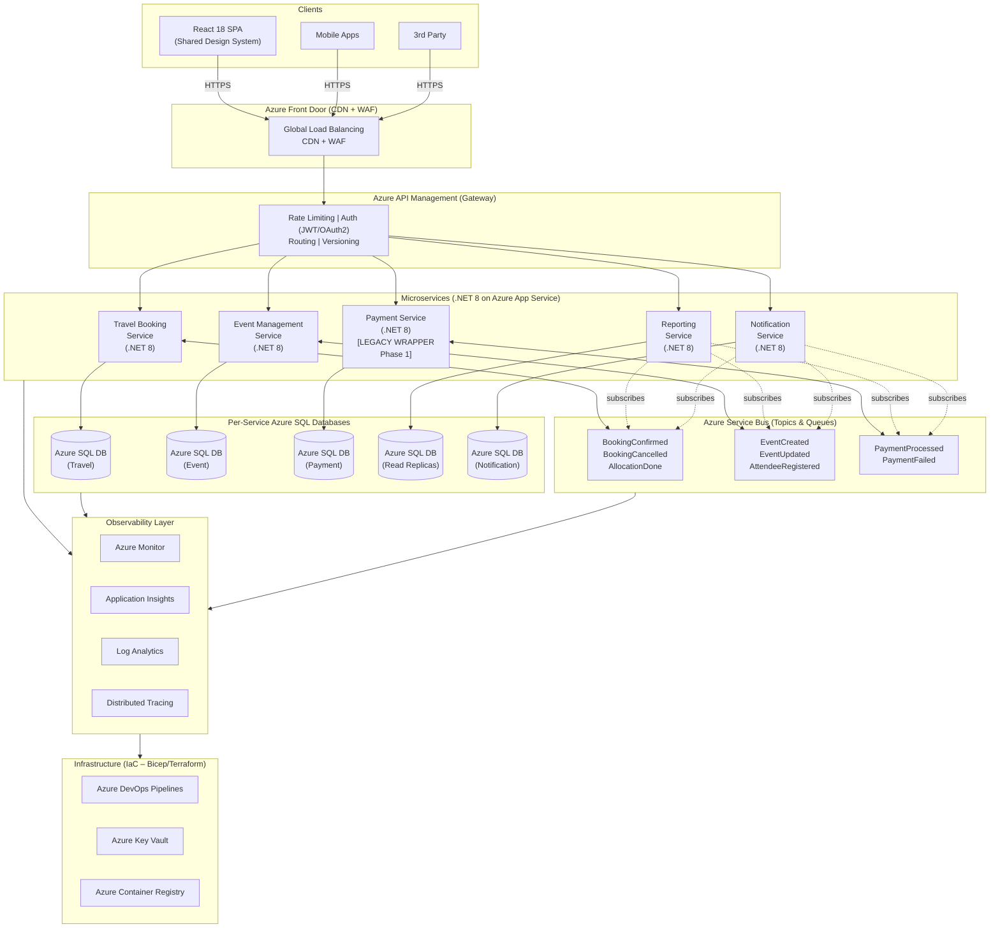

# Technical Assessment – Technical Lead (Azure Microservices)

**Candidate**: Dao Nhan Nguyen (daonhan@gmail.com)  
**Position**: .NET Technical Lead – Azure Microservices  

## 1. Target Architecture Overview

### 1.1 Proposed Service Boundaries (Bounded Contexts)
| Bounded Context | Service (.NET 8) | Responsibility | Data Ownership (Azure SQL) |
| :--- | :--- | :--- | :--- |
| **Travel** | Travel Booking | Search, itinerary, allocation algorithms, supplier integration. | `Travel_DB` |
| **Events** | Event Management | Event creation, scheduling, attendee registration, workforce. | `Event_DB` |
| **Payments** | Payment (Legacy Wrapper) | Payment processing, refunds, reconciliation. | `Payment_DB` *(Legacy schema)* |
| **Reporting** | Reporting | Dashboards, analytics, data aggregation (CQRS Read Model). | `Reporting_DB` *(Read Replicas)* |
| **Comms** | Notification | Centralized templates, email, SMS, push delivery. | `Notification_DB` |

### 1.2 Communication Model & Azure Components
* **Synchronous (REST/HTTP via Azure API Management):** Used for edge-to-service communication (user queries needing immediate responses, like fetching an itinerary). APIM acts as the Strangler Façade, handling routing, rate limiting, and auth.
* **Asynchronous Pub/Sub (Azure Service Bus Topics):** Used for cross-service state changes and eventual consistency (e.g., `BookingConfirmed` fanning out to Notifications and Reporting).
* **Asynchronous Command (Azure Service Bus Queues):** Used for reliable 1:1 task processing (e.g., generating a heavy export).

## 2. Rationale
* **Why these boundaries?** We isolate fast-changing, high-value domains (Travel, Events) from highly regulated/constrained domains (Payments). With only 5 engineers, dividing into 5 distinct contexts allows clear code-ownership and independent deployability without stepping on toes.
* **Why this communication model?** Defaulting to asynchronous events prevents the creation of a "distributed monolith." If the Notification Service goes down, the Booking flow remains unaffected. Service Bus natively supports the Dead-Letter Queuing (DLQ) and retry policies needed for enterprise-grade resilience.

## 3. Migration Strategy (The Strangler Fig Approach)

To meet the 9-month constraint with zero downtime and a preserved payment workflow, we will execute a progressive Strangler Fig migration.

* **Milestone 1: Foundations & Façade (Months 1-2):** Establish IaC (Bicep), CI/CD, and deploy Azure API Management. Route *all* traffic through the gateway to the legacy monolith. No changes to the user experience.
* **Milestone 2: Read-Model Extraction (Months 3-4):** Extract the lowest-risk, read-heavy Reporting Service. Implement Change Data Capture (CDC) on the legacy DB to push changes to `Reporting_DB`. Route APIM `/api/reports` traffic to the new .NET 8 service.
* **Milestone 3: Core Domain Extraction (Months 5-7):** Build the Event and Notification services. Introduce dual-writes: the monolith publishes domain events to Service Bus while writing to legacy DB. 
* **Milestone 4: Travel Booking & Payment ACL (Months 8-9):** Migrate the Travel Booking domain. Per constraints, the Payment logic remains untouched. We introduce an Anti-Corruption Layer (ACL)—a thin API wrapping the legacy payment module. The new Travel service communicates with this ACL, leaving the legacy payment database as the source of truth for financial transactions. 

## 4. Event-Driven Design

**Core Domain Events (Payload Outlines):**
1.  **`BookingConfirmed`**: `{ eventId, correlationId, bookingId, userId, travelDetails, totalAmount, timestamp }`
2.  **`EventCreated`**: `{ eventId, correlationId, organizerId, location, capacity, dates, timestamp }`
3.  **`PaymentProcessed`**: `{ eventId, correlationId, paymentId, bookingId, status, amount, timestamp }`
4.  **`AttendeeRegistered`**: `{ eventId, correlationId, registrationId, attendeeName, preferences, timestamp }`
5.  **`BookingCancelled`**: `{ eventId, correlationId, bookingId, reason, refundAmount, timestamp }`

* **Idempotency Strategy:** Every payload includes a UUID `eventId`. Consumers utilize an Inbox pattern (`ProcessedEvents` table) to check `IF EXISTS` before executing state changes, preventing duplicate processing.
* **Retry & Dead-Letter Handling:** Transient errors (e.g., network timeouts) use Polly exponential backoff (2s, 4s, 8s). Non-transient errors bypass retries and go directly to the DLQ. An Azure Function monitors the DLQ, alerting on-call engineers for manual remediation in this initial phase.
* **Message Ordering:** For strict sequence requirements within a single aggregate (e.g., Booking status updates), we utilize Azure Service Bus Sessions pegged to the `bookingId` to guarantee FIFO processing.
* **Observability:** W3C Trace Context headers are injected into the Service Bus message properties, allowing Azure Application Insights to map the end-to-end distributed trace across sync and async boundaries.

## 5. Risk & Failure Modeling

| Risk Scenario | Likelihood | Impact | Mitigation Strategy | Telemetry Signal |
| :--- | :--- | :--- | :--- | :--- |
| **Legacy DB Overloaded by CDC processes** | High | High | Use read-replicas for data extraction; throttle sync jobs; enforce single-writer-per-table rule. | DTU/vCore utilization spikes, CDC replication latency. |
| **Sync cascading failure to Legacy Payment**| Medium | High | Polly Circuit Breaker (open after 5 failures in 30s); 5s timeouts; Bulkhead isolation for HttpClients. | Circuit breaker state changes, 5xx error spikes at Gateway. |
| **Message loss or consumer crash** | Low | High | PeekLock mode on Service Bus; Transactional Outbox pattern to guarantee event publishing. | Active vs. DeadLettered message counts per topic. |
| **Eventual Consistency Lag** | High | Medium | Optimistic UI updates in React frontend; SignalR for real-time push to client when DB updates. | End-to-end processing latency (p95/p99). |
| **Deployment regression under load** | Medium | High | Blue/Green deployments via App Service slots; automated rollback if 5xx error rate > 1%. | Slot swap events, failed dependency calls in App Insights. |

## 6. Technical Leadership Decisions

* **What engineering standards would you introduce first?** Clean Architecture (decoupling domain logic from infrastructure) and the Transactional Outbox pattern. With a small team, a unified standard for structured logging (Serilog -> App Insights) with mandatory `correlationId` tracking is critical for debugging distributed systems.
* **What would you enforce in code reviews?** Mandatory idempotency handling in all message consumers. An 80% automated test coverage baseline on domain layers. No cross-service synchronous calls without architectural exemption.
* **How would you prevent the creation of a distributed monolith?** By ruthlessly enforcing boundary rules: services cannot share databases, and state changes must happen asynchronously via Service Bus. Consumer-Driven Contract Testing (e.g., Pact) in CI will ensure teams don't break each other's APIs.
* **What architectural shortcuts are you intentionally accepting?** Utilizing CDC and shared legacy DB views during the transition rather than aiming for pure event sourcing from Day 1. Wrapping the Payment monolith behind an ACL rather than refactoring it incurs temporary technical debt, but it guarantees we hit the 9-month constraint without touching the sensitive payment workflow.

## AI Usage Declaration
* **AI Tools Used**: Gemini 3.1 Pro / GitHub Copilot.
* **Sections AI-Assisted**: Brainstorming risk scenarios, structuring the Markdown for maximum density, and formatting the architectural patterns. 
* **Manual Validation**: I manually designed the bounded contexts, verified Azure Service Bus capabilities (Sessions, PeekLock), mapped out the Strangler Fig timeline to fit the strict 9-month/5-engineer constraints, and established the pragmatic technical debt acceptances.
* **Preventing Blind AI Usage**: As a Technical Lead, I enforce a strict "explain your design" culture. AI is an incredible pair-programmer, but engineers must defend the *why* behind their logic in PRs without relying on the prompt. AI-generated code must also meet all CI/CD testing and security (OWASP) benchmarks before merging.

