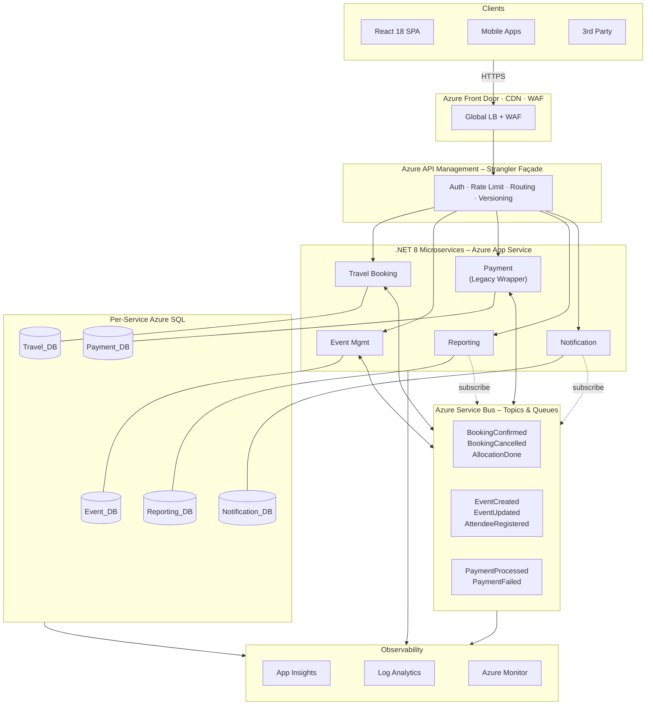
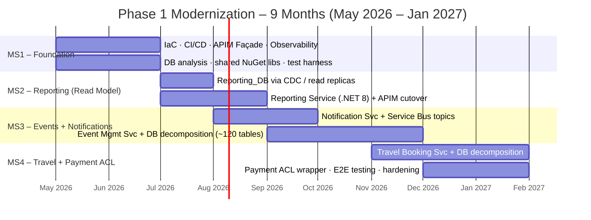
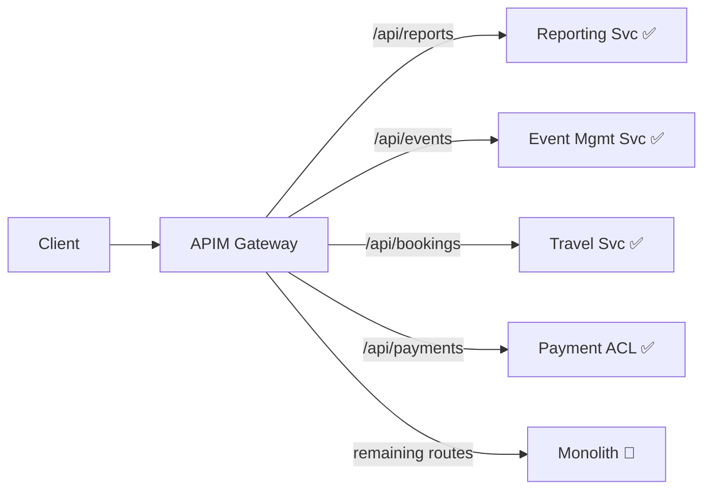
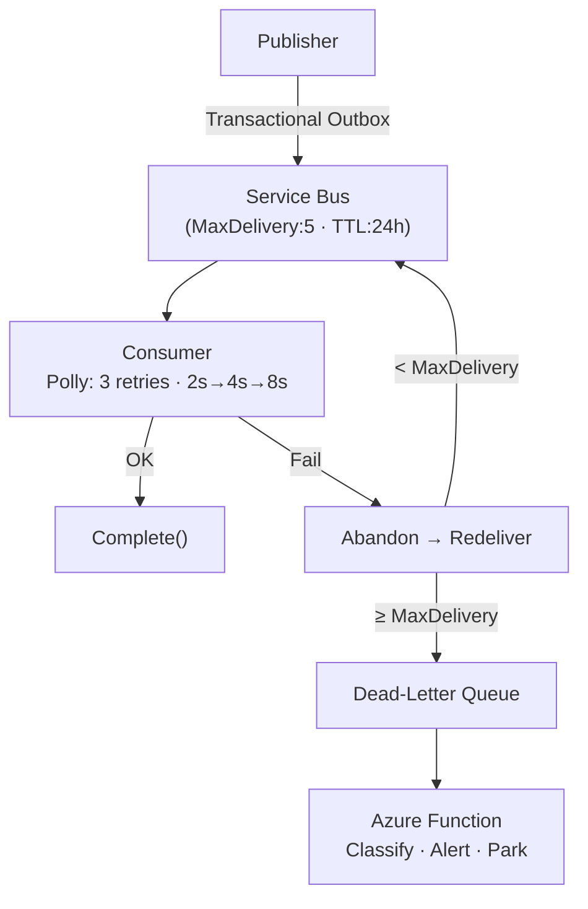

# Technical Assessment – Technical Lead (Azure Microservices)

**Candidate**: Dao Nhan Nguyen (daonhan@gmail.com)
**Position**: .NET Technical Lead – Azure Microservices

---

## 1. Target Architecture Overview

### 1.1 Service Boundaries (Bounded Contexts)

| Context | Service | Responsibility | DB |
|:---|:---|:---|:---|
| **Travel** | Travel Booking | Search, itinerary, allocation algorithms, supplier integration | `Travel_DB` |
| **Events** | Event Mgmt | Event CRUD, scheduling, attendee registration, workforce | `Event_DB` |
| **Payments** | Payment *(Legacy Wrapper)* | Processing, refunds, reconciliation — **unchanged in Phase 1** | `Payment_DB` |
| **Reporting** | Reporting | Dashboards, analytics, aggregation (CQRS read model) | `Reporting_DB` |
| **Comms** | Notification | Centralized email, SMS, push; templates, delivery logs | `Notification_DB` |

**Why these boundaries?** They mirror natural domain seams with different change cadences, regulatory requirements (PCI-DSS for Payments), and read/write profiles (Reporting is read-heavy). Five contexts map cleanly to five engineers, each owning a service end-to-end.

### 1.2 Communication Model

| Pattern | Technology | When Used | Example |
|:---|:---|:---|:---|
| Sync Request/Reply | REST via APIM | User-facing queries needing immediate response | GET booking, search events |
| Async Pub/Sub | Service Bus Topics | Cross-service state changes, eventual consistency | `BookingConfirmed` → Notification + Reporting |
| Async Command | Service Bus Queues | Reliable 1:1 task dispatch | Generate export, run allocation |

**Why this model?** Async-by-default prevents temporal coupling (distributed monolith). If Notification is down, bookings still complete — the event waits in Service Bus. Sync is reserved for the edge, where users expect immediate feedback.

### 1.3 Azure Component Map

| Component | Role |
|:---|:---|
| **App Service** | Host .NET 8 services; deployment slots for blue/green |
| **Azure SQL** | Per-service DBs; elastic pools during transition |
| **Service Bus** | Topics (pub/sub), Queues (commands), Sessions (ordering) |
| **API Management** | Gateway + Strangler façade; legacy proxy on Day 1 |
| **Front Door** | Global CDN, WAF, TLS termination |
| **App Insights + Log Analytics** | Distributed tracing, structured logs, dashboards |
| **Key Vault** | Secrets, connection strings, certificates |
| **Azure DevOps** | CI/CD pipelines, IaC deployment (Bicep) |

---

## 2. Migration Strategy — Strangler Fig (Sequenced Plan)

To meet the 9-month constraint with zero downtime and an untouched payment workflow, we execute a progressive Strangler Fig migration in four milestones. All client traffic routes through APIM from Day 1; individual URL paths are redirected to new services as each milestone completes.

### Strangler Fig Mechanics

Feature flags (Azure App Configuration) control rollout per route: 5% → 25% → 100%. Shadow traffic comparison validates parity before full cutover.

### Backward Compatibility & Zero Downtime

| Technique | Detail |
|:---|:---|
| **APIM versioning** | URL-path (`/v1/`) or `Accept-Version` header; old clients keep hitting v1 |
| **DB views as contracts** | When tables migrate, leave views in legacy DB (via CDC sync) during transition |
| **Anti-Corruption Layer** | New services never consume legacy schemas directly; ACL translates models |
| **Blue/Green slots** | App Service slot swap; automatic rollback if 5xx > 1% |
| **Online schema changes** | Expand-and-contract: add column → backfill → migrate reads → drop old column |
| **Single-writer rule** | Each table has exactly one writer at all times; multiple readers via CDC/views |

---

## 3. Event-Driven Design

### 3.1 Core Domain Events

| # | Event | Payload Outline |
|:--|:---|:---|
| 1 | `BookingConfirmed` | `eventId, correlationId, bookingId, userId, travelDetails{}, totalAmount, currency, paymentRef, ts` |
| 2 | `EventCreated` | `eventId, correlationId, orgEventId, organizerId, title, location, dates{}, capacity, status, ts` |
| 3 | `PaymentProcessed` | `eventId, correlationId, paymentId, bookingId, amount, currency, status, gatewayTxnId, ts` |
| 4 | `AttendeeRegistered` | `eventId, correlationId, registrationId, orgEventId, userId, name, regType, preferences[], ts` |
| 5 | `BookingCancelled` | `eventId, correlationId, bookingId, reason, cancellationFee, refundAmount, originalPaymentId, ts` |

### 3.2 Reliability Patterns

| Concern | Approach |
|:---|:---|
| **Idempotency** | UUID `eventId` + Inbox table (`ProcessedEvents`). Check-before-execute. Optimistic concurrency (`RowVersion`) as a second guard |
| **Retry** | Polly exponential backoff for transient errors; non-transient → DLQ immediately |
| **Dead-Letter** | Azure Function polls DLQ, classifies errors, alerts on-call. Manual remediation in this initial phase |
| **Ordering** | Service Bus Sessions keyed to aggregate ID (e.g., `bookingId`) guarantee FIFO within an entity. Cross-entity ordering not required |
| **Observability** | W3C `traceparent` propagated into Service Bus `CorrelationId`. App Insights maps full distributed trace. Structured logging (Serilog) with mandatory `correlationId, eventId, serviceId`. Azure Monitor alerts on `DeadLetteredMessageCount > 0` and consumer p99 latency |

---

## 4. Risk & Failure Modeling

| # | Scenario | L | I | Mitigation | Telemetry Signal |
|:--|:---|:--|:--|:---|:---|
| 1 | **Legacy DB overloaded** by CDC + dual access during transition | H | H | Read replicas for extraction; throttle CDC; single-writer-per-table; elastic pool resource governance | DTU % spikes, CDC latency, deadlock count |
| 2 | **Cascading failure** from sync call to legacy Payment | M | H | Polly Circuit Breaker (open after 5 fails/30s); 5s timeout; Bulkhead `HttpClient`; "provisional booking" fallback | CB state changes, 5xx rate at APIM, thread pool depth |
| 3 | **Message loss** — consumer crash before `Complete()` | L | H | PeekLock mode; Transactional Outbox guarantees publish; DLQ monitoring with immediate alerting | Active vs DLQ message counts, outbox pending rows |
| 4 | **Data inconsistency** between monolith and new service DBs | H | M | Single-writer rule; CDC lag alert > 30s; nightly checksum reconciliation; feature-flag atomic cutover (rollback < 1 min) | CDC lag, reconciliation pass/fail, user-reported discrepancies |
| 5 | **Deployment regression** passes staging, fails under prod load | M | H | Blue/Green slots; canary (5% for 15 min); Pact contract tests in CI; auto-rollback on 5xx > 1% | Slot swap events, error rate delta pre/post deploy, p99 latency |

---

## 5. Technical Leadership Decisions

**What standards first?**
Clean Architecture per service (API → Application → Domain → Infrastructure). Structured logging (Serilog → App Insights) with mandatory `correlationId`. OpenAPI 3.0 spec-first. `.editorconfig` + analyzers enforced in CI. 80% test coverage on domain layers.

**What to enforce in code reviews?**
Idempotent event handlers. No cross-service DB access. No synchronous inter-service calls without architectural exemption. Correct async/await (no `.Result`). Input validation. Secrets via Key Vault only.

**How to prevent a distributed monolith?**
Async-by-default rule: every sync inter-service call requires written justification. Independent deployability verified each sprint. No shared domain models — only infrastructure NuGet packages (logging, health checks, event envelope). Consumer-Driven Contract Tests (Pact) in CI. Architecture fitness functions detect coupling in dependency graphs.

**What shortcuts are intentionally accepted?**

| Shortcut | Why | Future Resolution |
|:---|:---|:---|
| Payment is a legacy wrapper, not a true microservice | Constraint: cannot change in Phase 1 | Full rewrite in Phase 2 |
| App Service over AKS | 5 engineers can't justify K8s ops overhead | Evaluate AKS if services > 10 |
| CDC sync over event sourcing | Pragmatic for 9-month timeline | Adopt per-aggregate post-Phase 1 |
| Manual DLQ remediation | Automated classification is complex to get right initially | Build DLQ processor Function incrementally |

---

## 6. AI Usage Declaration

| | Detail |
|:---|:---|
| **Tools** | Gemini 2.5 Pro, GitHub Copilot |
| **AI-Assisted** | Brainstorming risk scenarios; structuring Markdown for density; formatting architectural patterns; drafting event payload outlines |
| **Manually Validated** | Bounded context decomposition; Azure Service Bus capabilities (Sessions, PeekLock, Outbox compatibility); Strangler Fig timeline feasibility against 5-engineer/9-month constraint; pragmatic tech-debt trade-offs; communication model rationale |
| **Preventing Blind AI Usage** | Enforce "explain your design" culture — engineers must defend *why* in PRs, not just paste AI output. AI-generated code meets the same CI bar: 80% coverage, Pact contracts, OWASP scan, analyzer-clean. Pair programming rotations build the judgment AI cannot replace. ADRs document decisions with context and alternatives considered |