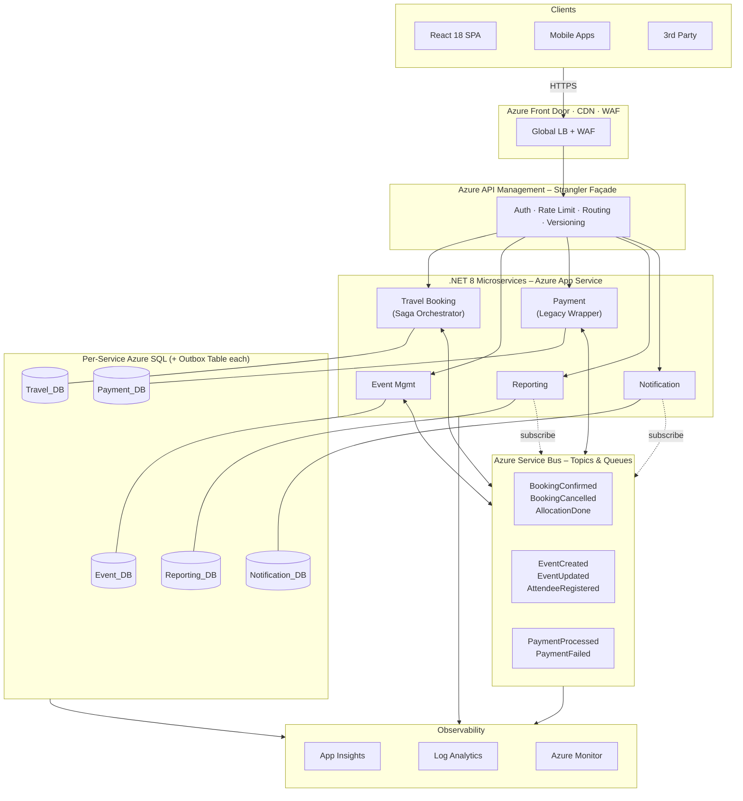
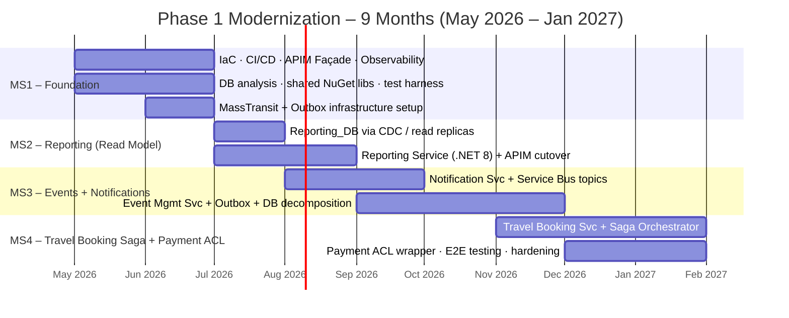
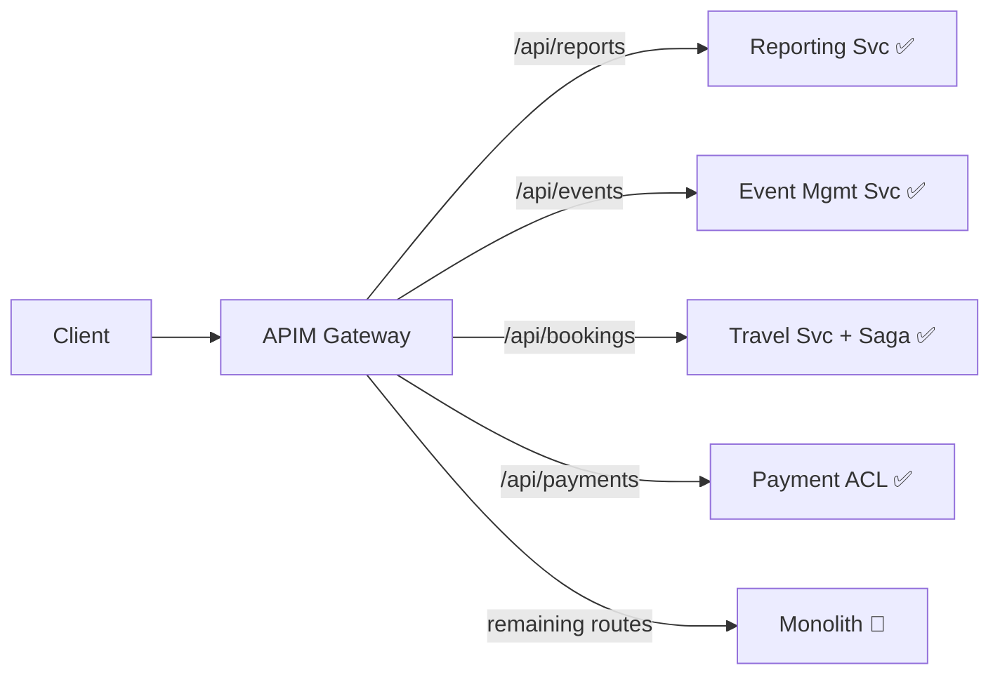
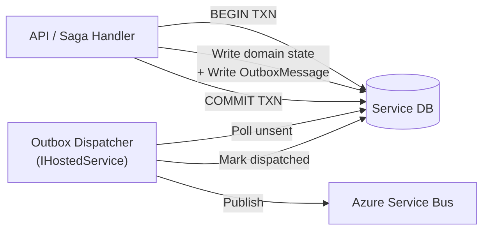
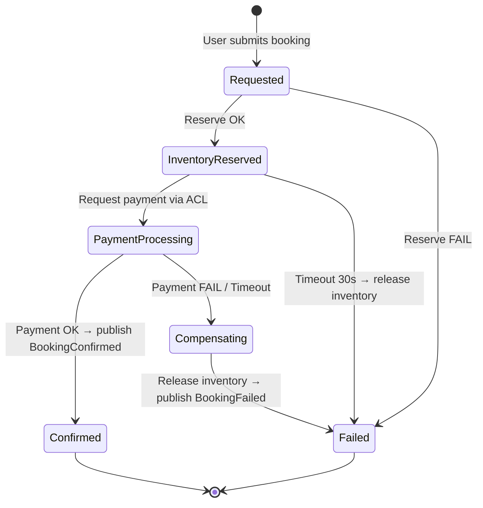
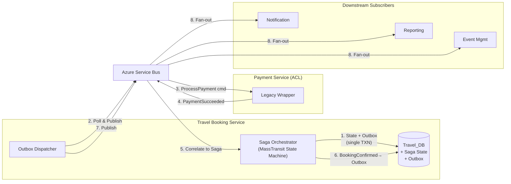
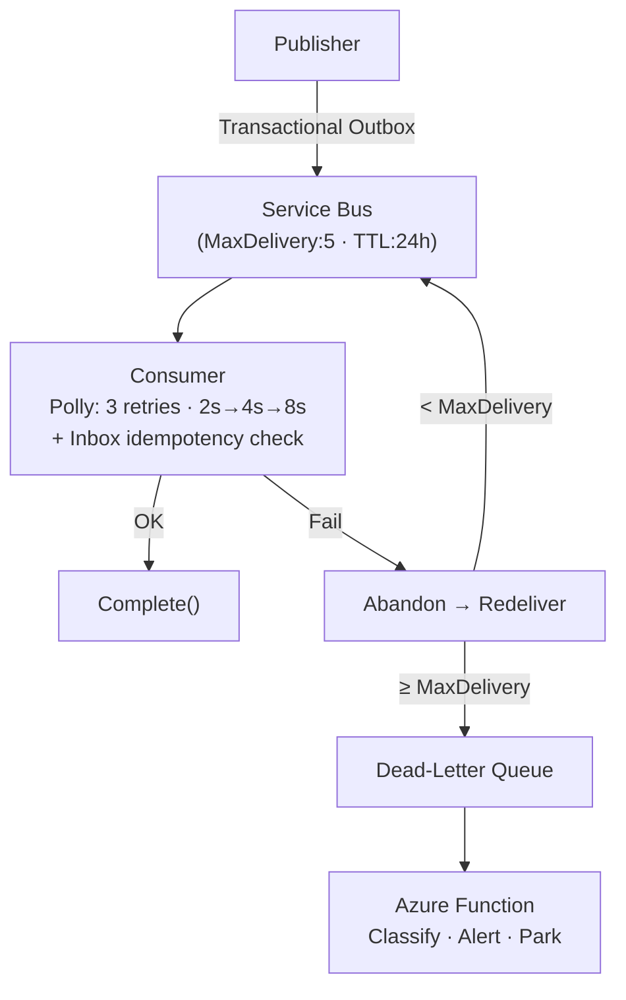

# Technical Assessment – Technical Lead (Azure Microservices)

**Candidate**: Dao Nhan Nguyen (daonhan@gmail.com)
**Position**: .NET Technical Lead – Azure Microservices

---

## 1. Target Architecture Overview

### 1.1 Service Boundaries (Bounded Contexts)

| Context | Service | Responsibility | DB |
|:---|:---|:---|:---|
| **Travel** | Travel Booking *(Saga Orchestrator)* | Search, itinerary, allocation, supplier integration, booking workflow orchestration | `Travel_DB` *(+ Saga State + Outbox tables)* |
| **Events** | Event Mgmt | Event CRUD, scheduling, attendee registration, workforce | `Event_DB` *(+ Outbox table)* |
| **Payments** | Payment *(Legacy Wrapper)* | Processing, refunds, reconciliation — **unchanged in Phase 1** | `Payment_DB` *(+ Outbox table)* |
| **Reporting** | Reporting | Dashboards, analytics, aggregation (CQRS read model) | `Reporting_DB` |
| **Comms** | Notification | Centralized email, SMS, push; templates, delivery logs | `Notification_DB` |

**Why these boundaries?** They mirror natural domain seams with different change cadences, regulatory requirements (PCI-DSS for Payments), and read/write profiles (Reporting is read-heavy). Five contexts map cleanly to five engineers, each owning a service end-to-end.

### 1.2 Communication Model

| Pattern | Technology | When Used | Example |
|:---|:---|:---|:---|
| Sync Request/Reply | REST via APIM | Edge-to-service user queries needing immediate response | GET booking, search events |
| Async Pub/Sub | Service Bus Topics | Cross-service state changes, eventual consistency | `BookingConfirmed` → Notification + Reporting |
| Async Command | Service Bus Queues | Reliable 1:1 task dispatch within Saga workflows | `ProcessPayment`, `ReleaseInventory` |
| Transactional Outbox | EF Core + same DB | Guaranteeing atomicity between DB writes and event publishing | Every service that publishes domain events |
| Orchestration Saga | MassTransit State Machine | Multi-step workflows with compensation | Booking flow: reserve → pay → confirm/compensate |

**Why this model?** Async-by-default prevents temporal coupling (distributed monolith). The Transactional Outbox eliminates the dual-write problem — a DB commit and an event publish can never diverge. The Saga orchestrator gives us explicit, testable control over the booking workflow's happy and compensation paths, which is critical when integrating with the constrained legacy Payment system.

### 1.3 Azure Component Map

| Component | Role |
|:---|:---|
| **App Service** | Host .NET 8 services; deployment slots for blue/green |
| **Azure SQL** | Per-service DBs; elastic pools during transition; hosts Outbox + Saga State tables |
| **Service Bus** | Topics (pub/sub fan-out), Queues (saga commands), Sessions (ordering) |
| **API Management** | Gateway + Strangler façade; legacy proxy on Day 1 |
| **Front Door** | Global CDN, WAF, TLS termination |
| **App Insights + Log Analytics** | Distributed tracing, structured logs, dashboards |
| **Key Vault** | Secrets, connection strings, certificates |
| **Azure DevOps** | CI/CD pipelines, IaC deployment (Bicep) |

---

## 2. Migration Strategy — Strangler Fig (Sequenced Plan)

To meet the 9-month constraint with zero downtime and an untouched payment workflow, we execute a progressive Strangler Fig migration in four milestones. All client traffic routes through APIM from Day 1; individual URL paths are redirected to new services as each milestone completes.

### Strangler Fig Mechanics

Feature flags (Azure App Configuration) control rollout per route: 5% → 25% → 100%. Shadow traffic comparison validates parity before full cutover.

### Backward Compatibility & Zero Downtime

| Technique | Detail |
|:---|:---|
| **APIM versioning** | URL-path (`/v1/`) or `Accept-Version` header; old clients keep hitting v1 |
| **DB views as contracts** | When tables migrate, leave views in legacy DB (via CDC sync) during transition |
| **Anti-Corruption Layer** | New services never consume legacy schemas directly; ACL translates models |
| **Blue/Green slots** | App Service slot swap; automatic rollback if 5xx > 1% |
| **Online schema changes** | Expand-and-contract: add column → backfill → migrate reads → drop old column |
| **Single-writer rule** | Each table has exactly one writer at all times; multiple readers via CDC/views |

---

## 3. Event-Driven Design

### 3.1 Core Domain Events

| # | Event | Payload Outline |
|:--|:---|:---|
| 1 | `BookingConfirmed` | `eventId, correlationId, bookingId, userId, travelDetails{}, totalAmount, currency, paymentRef, ts` |
| 2 | `EventCreated` | `eventId, correlationId, orgEventId, organizerId, title, location, dates{}, capacity, status, ts` |
| 3 | `PaymentProcessed` | `eventId, correlationId, paymentId, bookingId, amount, currency, status, gatewayTxnId, ts` |
| 4 | `AttendeeRegistered` | `eventId, correlationId, registrationId, orgEventId, userId, name, regType, preferences[], ts` |
| 5 | `BookingCancelled` | `eventId, correlationId, bookingId, reason, cancellationFee, refundAmount, originalPaymentId, ts` |

### 3.2 Transactional Outbox Pattern

Every service that publishes domain events uses the Transactional Outbox to guarantee atomicity between database writes and message publishing — eliminating the dual-write problem.

The Outbox table resides in the **same database** as the service's domain tables, ensuring a single local transaction. A background dispatcher (MassTransit's built-in EF Core Outbox) polls for undispatched messages and publishes them to Service Bus. If the broker is temporarily unavailable, messages accumulate safely in the Outbox and are delivered on the next successful poll. Combined with consumer-side idempotency (Inbox table checking `eventId`), this achieves **exactly-once processing** semantics.

**Which services use it?** Travel Booking (events + saga commands), Event Management (`EventCreated`, `AttendeeRegistered`), and Payment wrapper (`PaymentProcessed`, `PaymentFailed`). Reporting and Notification are pure consumers — they do not publish events.

### 3.3 Saga Pattern — Booking Orchestration

The booking workflow spans Travel, Payment, and downstream services. We use an **orchestration-based Saga** (MassTransit State Machine) hosted in the Travel Booking Service to coordinate the multi-step process with explicit compensation logic.

**Saga + Outbox integration:** Every saga state transition persists the new state **and** any outgoing commands/events into the Outbox table within a single database transaction. The dispatcher then reliably publishes them. A saga step can never "half-complete" — either the state advances and the message is queued for publish, or nothing happens.

**Compensation flows:**

| Failure Point | Compensation | Executor |
|:---|:---|:---|
| Inventory reservation fails | None needed — nothing committed | Saga → `Failed` |
| Payment timeout (30s) | `ReleaseInventory` command | Saga orchestrator via Outbox |
| Payment rejected | `ReleaseInventory` + optional `RefundInitiated` | Saga orchestrator via Outbox |
| Notification delivery fails | No saga compensation — non-critical | Service Bus retry + DLQ |

### 3.4 Reliability Patterns

| Concern | Approach |
|:---|:---|
| **Idempotency** | UUID `eventId` + consumer Inbox table (check-before-execute). Optimistic concurrency (`RowVersion`) as second guard |
| **Atomicity** | Transactional Outbox — domain state + outgoing messages committed in one SQL transaction |
| **Saga consistency** | Orchestrator state + commands persisted atomically via Outbox; compensation on every failure path |
| **Retry** | Polly exponential backoff for transient errors; non-transient → DLQ immediately |
| **Dead-Letter** | Azure Function polls DLQ, classifies errors, alerts on-call. Manual remediation initially |
| **Ordering** | Service Bus Sessions keyed to aggregate ID (e.g., `bookingId`) for FIFO within one entity |
| **Observability** | W3C `traceparent` propagated via Service Bus `CorrelationId`. Serilog structured logs with mandatory `correlationId, eventId, serviceId`. Azure Monitor alerts on `DeadLetteredMessageCount > 0` and consumer p99 latency |

---

## 4. Risk & Failure Modeling

| # | Scenario | L | I | Mitigation | Telemetry Signal |
|:--|:---|:--|:--|:---|:---|
| 1 | **Legacy DB overloaded** by CDC + dual access during transition | H | H | Read replicas for extraction; throttle CDC; single-writer-per-table; elastic pool resource governance | DTU % spikes, CDC latency, deadlock count |
| 2 | **Saga stuck in intermediate state** due to Payment ACL unresponsiveness | M | H | 30s saga timeout with scheduled message; compensation path releases inventory; Polly Circuit Breaker on ACL calls | Saga instances in `PaymentProcessing` > 5 min, CB state changes, 5xx rate at APIM |
| 3 | **Outbox dispatcher lag** — messages accumulate, events delayed | M | M | Monitor Outbox table pending count; alert if pending > 100 or oldest undispatched > 60s; scale dispatcher if needed | `OutboxPendingCount` custom metric, oldest undispatched age, consumer end-to-end latency |
| 4 | **Data inconsistency** between monolith and new service DBs | H | M | Single-writer rule; CDC lag alert > 30s; nightly checksum reconciliation; feature-flag atomic cutover (rollback < 1 min) | CDC lag, reconciliation pass/fail, user-reported discrepancies |
| 5 | **Deployment regression** passes staging, fails under prod load | M | H | Blue/Green slots; canary (5% for 15 min); Pact contract tests in CI; auto-rollback on 5xx > 1% | Slot swap events, error rate delta pre/post deploy, p99 latency |

---

## 5. Technical Leadership Decisions

**What standards first?**
Clean Architecture per service (API → Application → Domain → Infrastructure). Transactional Outbox as the **only** permitted mechanism for publishing domain events — direct Service Bus publish from request handlers is forbidden. Structured logging (Serilog → App Insights) with mandatory `correlationId`. OpenAPI 3.0 spec-first. `.editorconfig` + analyzers enforced in CI. 80% test coverage on domain layers.

**What to enforce in code reviews?**
Idempotent event handlers with Inbox table checks. Every saga state transition must include a compensation path. No cross-service DB access. No synchronous inter-service calls without architectural exemption. Correct async/await (no `.Result`). Input validation. Secrets via Key Vault only. Outbox messages must be part of the same EF `SaveChangesAsync` call as domain state changes.

**How to prevent a distributed monolith?**
Async-by-default rule: every sync inter-service call requires written justification. The Saga orchestrator only communicates with other services through Service Bus commands/events — never direct HTTP. Independent deployability verified each sprint. No shared domain models — only infrastructure NuGet packages (logging, health checks, event envelope). Consumer-Driven Contract Tests (Pact) in CI. Architecture fitness functions detect coupling in dependency graphs.

**What shortcuts are intentionally accepted?**

| Shortcut | Why | Future Resolution |
|:---|:---|:---|
| Payment is a legacy wrapper, not a true microservice | Constraint: cannot change in Phase 1. Saga + ACL isolates it cleanly | Full rewrite in Phase 2 with native saga participant |
| App Service over AKS | 5 engineers can't justify K8s ops overhead | Evaluate AKS if services > 10 |
| Orchestration saga over choreography | Simpler to reason about with a legacy payment dependency | Re-evaluate choreography when Payment is fully modernized |
| MassTransit EF Outbox over custom implementation | Battle-tested library; faster to adopt for a small team | Retain unless performance profiling shows bottleneck |
| Manual DLQ remediation | Automated classification is complex to get right initially | Build DLQ processor Function incrementally |

---

## 6. AI Usage Declaration

| | Detail |
|:---|:---|
| **Tools** | Gemini 2.5 Pro, GitHub Copilot |
| **AI-Assisted** | Brainstorming risk scenarios; structuring Markdown for density; formatting architectural patterns; drafting event payload outlines; Saga state machine pseudocode |
| **Manually Validated** | Bounded context decomposition; Azure Service Bus capabilities (Sessions, PeekLock); MassTransit Saga + EF Core Outbox integration model; Strangler Fig timeline feasibility against 5-engineer/9-month constraint; Saga compensation design; pragmatic tech-debt trade-offs |
| **Preventing Blind AI Usage** | Enforce "explain your design" culture — engineers must defend *why* in PRs, not just paste AI output. AI-generated code meets the same CI bar: 80% coverage, Pact contracts, OWASP scan, analyzer-clean. Pair programming rotations build the judgment AI cannot replace. ADRs document decisions with context and alternatives considered |