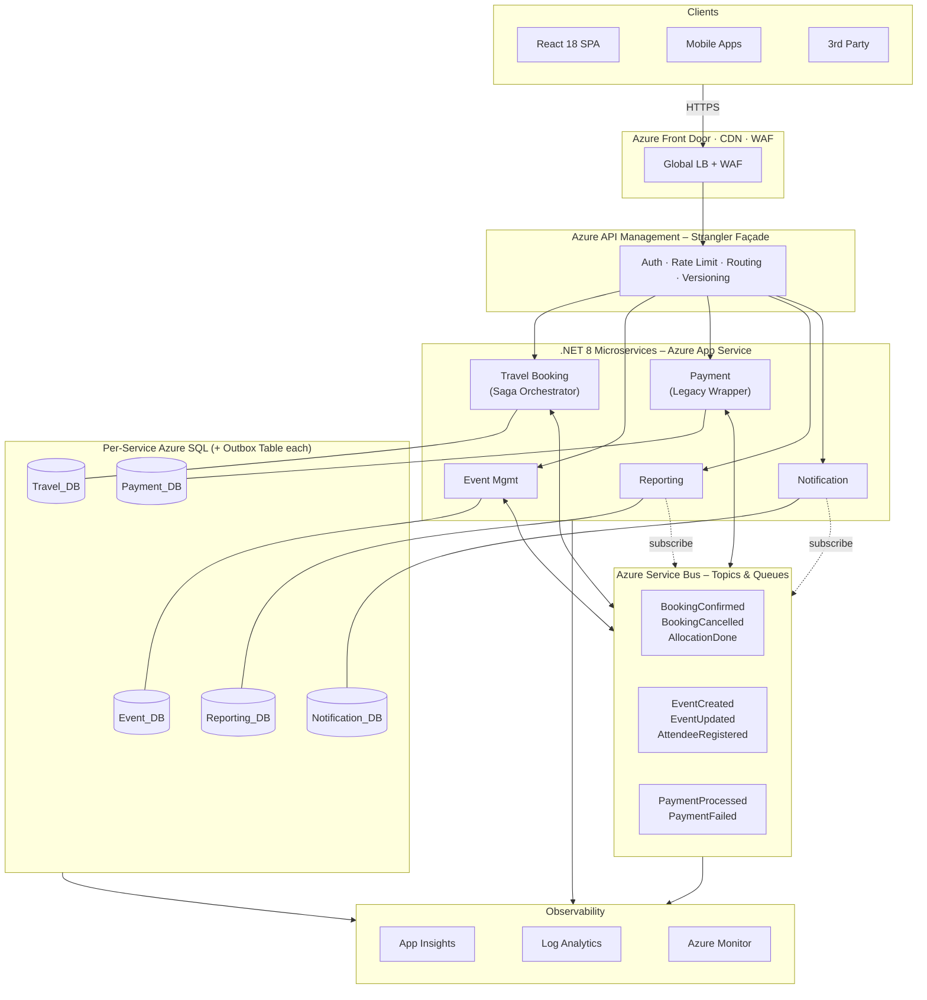
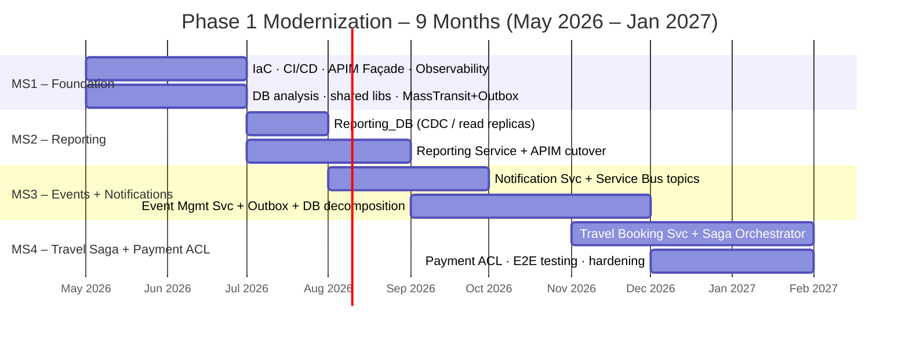
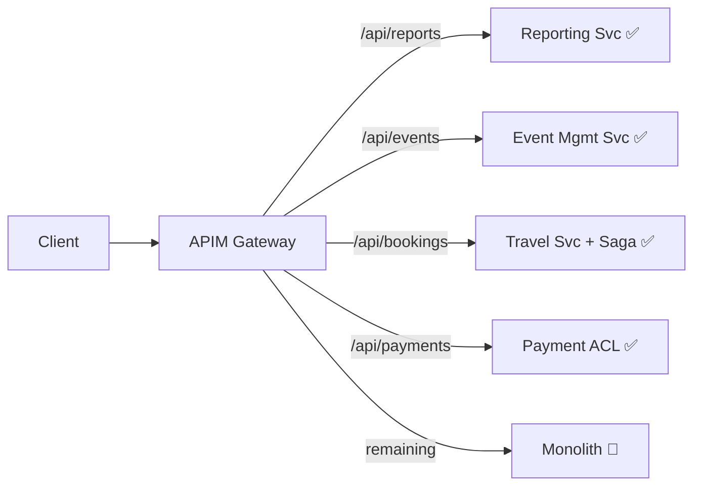
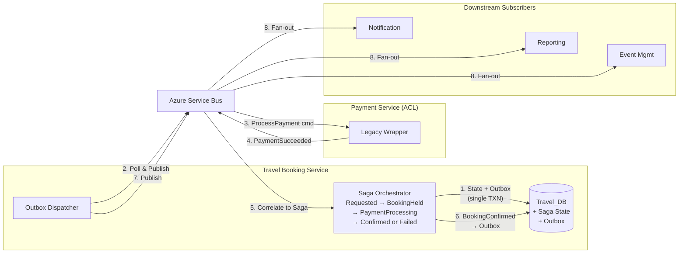
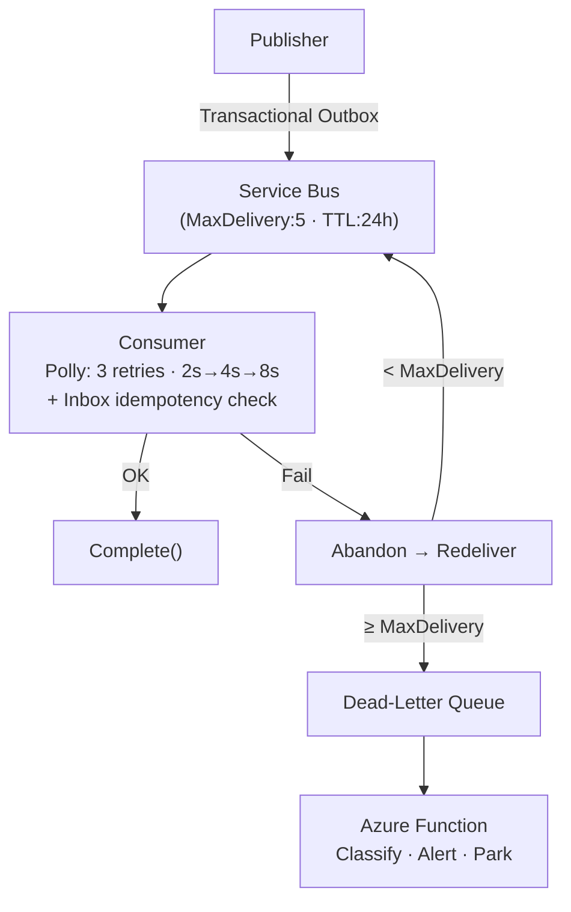

# Technical Assessment – Technical Lead (Azure Microservices)

**Candidate**: Dao Nhan Nguyen (daonhan@gmail.com)
**Position**: .NET Technical Lead – Azure Microservices

---

## 1. Target Architecture Overview

### 1.1 Service Boundaries (Bounded Contexts)

| Context | Service | Responsibility | DB |
|:---|:---|:---|:---|
| **Travel** | Travel Booking *(Saga Orchestrator)* | Search, itinerary, allocation, supplier integration, booking workflow orchestration | `Travel_DB` *(+ Saga State + Outbox)* |
| **Events** | Event Mgmt | Event CRUD, scheduling, attendee registration, workforce | `Event_DB` *(+ Outbox)* |
| **Payments** | Payment *(Legacy Wrapper)* | Processing, refunds, reconciliation — **unchanged in Phase 1** | `Payment_DB` *(+ Outbox)* |
| **Reporting** | Reporting | Dashboards, analytics, aggregation (CQRS read model) | `Reporting_DB` |
| **Comms** | Notification | Centralized email, SMS, push; templates, delivery logs | `Notification_DB` |

**Why these boundaries?** They mirror natural domain seams with different change cadences, regulatory needs (PCI-DSS for Payments), and read/write profiles. Five contexts map to five engineers, each owning a service end-to-end.

### 1.2 Communication Model

| Pattern | Technology | When Used | Example |
|:---|:---|:---|:---|
| Sync Request/Reply | REST via APIM | Edge-to-service queries needing immediate response | GET booking, search events |
| Async Pub/Sub | Service Bus Topics | Cross-service state changes, eventual consistency | `BookingConfirmed` → Notification + Reporting |
| Async Command | Service Bus Queues | Reliable 1:1 task dispatch within Saga workflows | `ProcessPayment`, `ReleaseBookingHold` |
| Transactional Outbox | MassTransit EF Core Outbox | Atomicity between DB writes and event publishing | Every service that publishes domain events |
| Orchestration Saga | MassTransit State Machine | Multi-step workflows with compensation | Booking: hold → pay → confirm / compensate |

**Why this model?** Async-by-default prevents temporal coupling. The Transactional Outbox eliminates the dual-write problem — a DB commit and an event publish can never diverge. The Saga orchestrator gives explicit, testable control over the booking workflow's happy and compensation paths, critical when integrating with the constrained legacy Payment system.

### 1.3 Azure Component Map

| Component | Role |
|:---|:---|
| **App Service** | Host .NET 8 services; deployment slots for blue/green |
| **Azure SQL** | Per-service DBs; elastic pools during transition; hosts Outbox + Saga State tables |
| **Service Bus** | Topics (pub/sub fan-out), Queues (saga commands), Sessions (ordering) |
| **API Management** | Gateway + Strangler façade; legacy proxy on Day 1 |
| **Front Door** | Global CDN, WAF, TLS termination |
| **App Insights + Log Analytics** | Distributed tracing, structured logs, dashboards |
| **Key Vault** | Secrets, connection strings, certificates |
| **Azure DevOps** | CI/CD pipelines, IaC deployment (Bicep) |

---

## 2. Migration Strategy — Strangler Fig (Sequenced Plan)

All client traffic routes through APIM from Day 1; individual URL paths redirect to new services as each milestone completes.

### Strangler Fig Mechanics

Feature flags (Azure App Configuration) control rollout: 5% → 25% → 100%. Shadow traffic validates parity before cutover.

### Backward Compatibility & Zero Downtime

| Technique | Detail |
|:---|:---|
| **APIM versioning** | URL-path (`/v1/`) or `Accept-Version` header |
| **DB views as contracts** | Views in legacy DB via CDC sync during transition |
| **Anti-Corruption Layer** | ACL translates between legacy and new domain models |
| **Blue/Green slots** | App Service slot swap; auto-rollback if 5xx > 1% |
| **Online schema changes** | Expand-and-contract pattern; Azure SQL online index rebuild |
| **Single-writer rule** | One writer per table; multiple readers via CDC/views |

---

## 3. Event-Driven Design

### 3.1 Core Domain Events

| # | Event | Payload Outline |
|:--|:---|:---|
| 1 | `BookingConfirmed` | `eventId, correlationId, bookingId, userId, travelDetails{}, totalAmount, currency, paymentRef, ts` |
| 2 | `EventCreated` | `eventId, correlationId, orgEventId, organizerId, title, location, dates{}, capacity, status, ts` |
| 3 | `PaymentProcessed` | `eventId, correlationId, paymentId, bookingId, amount, currency, status, gatewayTxnId, ts` |
| 4 | `AttendeeRegistered` | `eventId, correlationId, registrationId, orgEventId, userId, name, regType, preferences[], ts` |
| 5 | `BookingCancelled` | `eventId, correlationId, bookingId, reason, cancellationFee, refundAmount, originalPaymentId, ts` |

### 3.2 Transactional Outbox Pattern

Every publishing service writes domain state **and** an `OutboxMessage` row within the same SQL transaction — eliminating the dual-write problem. MassTransit's EF Core Outbox dispatcher polls for unsent messages and publishes them to Service Bus. If the broker is briefly unavailable, messages accumulate safely in the Outbox table. Combined with consumer-side Inbox idempotency checks on `eventId`, this achieves exactly-once processing.

**Services using Outbox:** Travel Booking (events + saga commands), Event Management, Payment wrapper. Reporting and Notification are pure consumers.

### 3.3 Saga Pattern — Booking Orchestration with Outbox

The booking workflow spans Travel, Payment, and downstream services. An **orchestration-based Saga** (MassTransit State Machine) in the Travel Booking Service coordinates the multi-step process. When a user requests a booking, the saga first places a **temporary hold** on the travel resources (flight seats, hotel rooms, event slots) before requesting payment. Every state transition persists new saga state **and** outgoing commands/events into the Outbox within a single transaction — a step can never "half-complete."

**Compensation flows:**

| Failure Point | Compensation | Executor |
|:---|:---|:---|
| Booking hold fails (no availability) | None — nothing committed | Saga → `Failed` |
| Payment timeout (30s) | `ReleaseBookingHold` — seats/rooms returned to available pool | Saga orchestrator via Outbox |
| Payment rejected | `ReleaseBookingHold` + optional `RefundInitiated` | Saga orchestrator via Outbox |
| Notification delivery fails | No saga compensation — non-critical | Service Bus retry + DLQ |

### 3.4 Reliability Patterns

| Concern | Approach |
|:---|:---|
| **Idempotency** | UUID `eventId` + consumer Inbox table. Optimistic concurrency (`RowVersion`) as second guard |
| **Atomicity** | Transactional Outbox — domain state + messages in one SQL transaction |
| **Saga consistency** | Saga state + commands persisted atomically; every failure path triggers compensation (e.g., `ReleaseBookingHold`) |
| **Retry** | Polly exponential backoff (transient); non-transient → DLQ immediately |
| **Dead-Letter** | Azure Function polls DLQ, classifies, alerts on-call. Manual remediation initially |
| **Ordering** | Service Bus Sessions keyed to aggregate ID for FIFO within one entity |
| **Observability** | W3C `traceparent` → Service Bus `CorrelationId`. Serilog with `correlationId, eventId, serviceId`. Alerts on `DeadLetteredMessageCount > 0` and p99 latency |

---

## 4. Risk & Failure Modeling

| # | Scenario | L | I | Mitigation | Telemetry Signal |
|:--|:---|:--|:--|:---|:---|
| 1 | **Legacy DB overloaded** by CDC + dual access | H | H | Read replicas; throttle CDC; single-writer rule; elastic pool governance | DTU %, CDC latency, deadlocks |
| 2 | **Saga stuck** — Payment ACL unresponsive, booking held indefinitely | M | H | 30s saga timeout (scheduled message); compensation releases held bookings; Polly CB on ACL | Saga instances in `PaymentProcessing` > 5 min, CB state |
| 3 | **Outbox dispatcher lag** — events delayed | M | M | Alert if pending > 100 or oldest > 60s; scale dispatcher | `OutboxPendingCount`, oldest undispatched age |
| 4 | **Data inconsistency** between monolith and new DBs | H | M | Single-writer; CDC lag alert > 30s; nightly checksum reconciliation; feature-flag rollback < 1 min | CDC lag, reconciliation pass/fail |
| 5 | **Deployment regression** under prod load | M | H | Blue/Green slots; canary 5% for 15 min; Pact contract tests; auto-rollback on 5xx > 1% | Error rate delta, p99 latency, slot swap events |

---

## 5. Technical Leadership Decisions

**What standards first?**
Clean Architecture per service. Transactional Outbox as the **only** permitted event publishing mechanism — direct Service Bus publish from handlers is forbidden. Structured logging (Serilog → App Insights) with mandatory `correlationId`. OpenAPI 3.0 spec-first. `.editorconfig` + analyzers in CI. 80% test coverage on domain layers.

**What to enforce in code reviews?**
Idempotent event handlers with Inbox checks. Every saga transition must have a compensation path. No cross-service DB access. No sync inter-service calls without exemption. Outbox writes must be in the same `SaveChangesAsync` as domain state. Correct async/await. Secrets via Key Vault only.

**How to prevent a distributed monolith?**
Async-by-default: every sync call requires written justification. Saga communicates only via Service Bus — never direct HTTP. Independent deployability verified each sprint. No shared domain models. Consumer-Driven Contract Tests (Pact) in CI. Fitness functions detect coupling.

**What shortcuts are intentionally accepted?**

| Shortcut | Why | Future Resolution |
|:---|:---|:---|
| Payment is a legacy wrapper | Constraint: cannot change. Saga + ACL isolates it | Full rewrite in Phase 2 |
| App Service over AKS | 5 engineers can't justify K8s ops overhead | Evaluate if services > 10 |
| Orchestration over choreography | Simpler with legacy Payment dependency | Re-evaluate post-Payment modernization |
| MassTransit EF Outbox over custom | Battle-tested; faster to adopt for small team | Retain unless perf profiling shows bottleneck |
| Manual DLQ remediation | Auto-classification complex initially | Build DLQ processor incrementally |

---

## 6. AI Usage Declaration

| | Detail |
|:---|:---|
| **Tools** | Gemini 2.5 Pro, GitHub Copilot |
| **AI-Assisted** | Brainstorming risks; Markdown structure; pattern formatting; event payload outlines; Saga pseudocode |
| **Manually Validated** | Bounded context decomposition; Service Bus capabilities (Sessions, PeekLock); MassTransit Saga + EF Outbox integration; Strangler Fig timeline vs. 5-engineer/9-month constraint; Saga compensation design; trade-off decisions |
| **Preventing Blind AI Usage** | "Explain your design" culture — engineers defend *why* in PRs. AI code meets the same CI bar: 80% coverage, Pact contracts, OWASP scan, analyzer-clean. Pair programming builds judgment AI cannot replace. ADRs document decisions with context and alternatives |