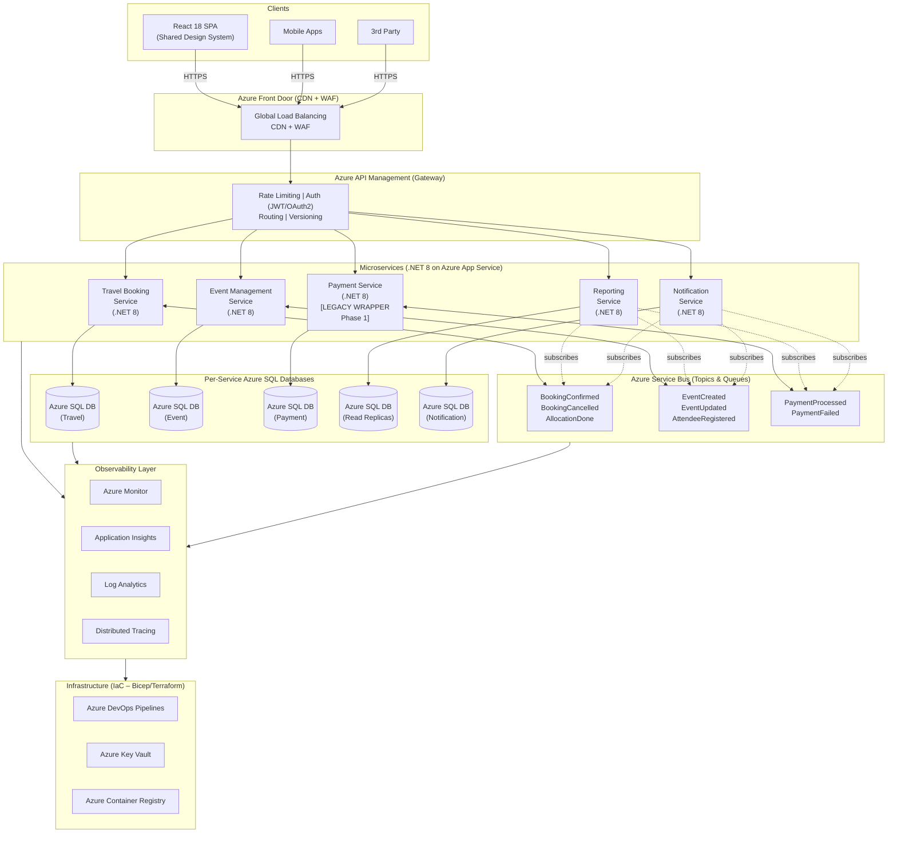
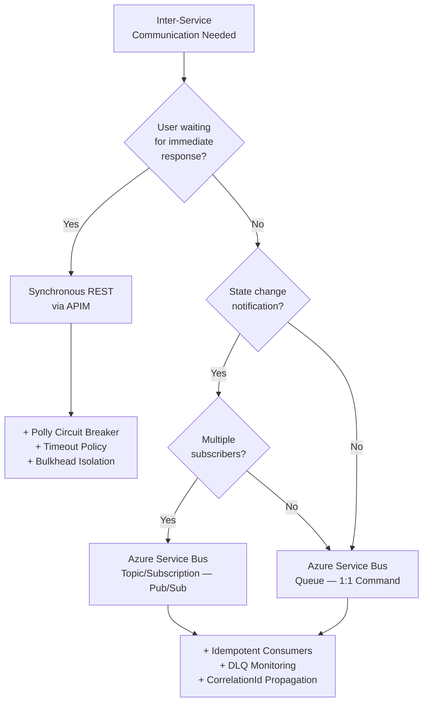
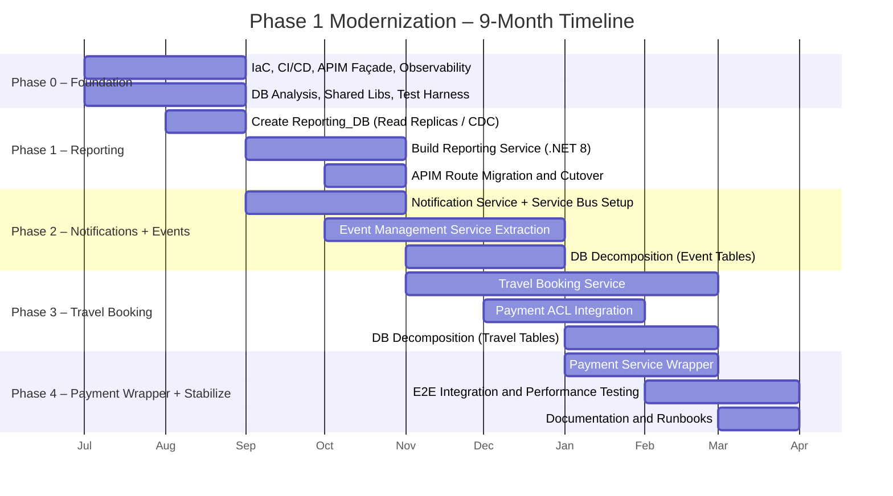
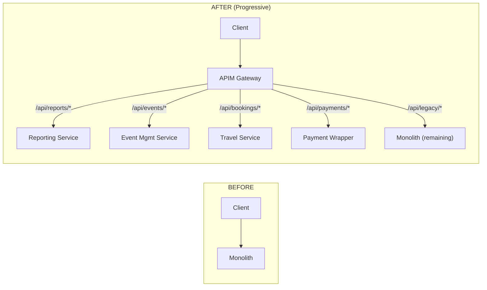
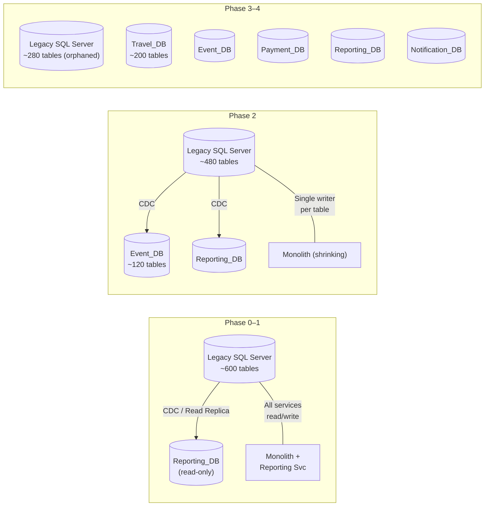
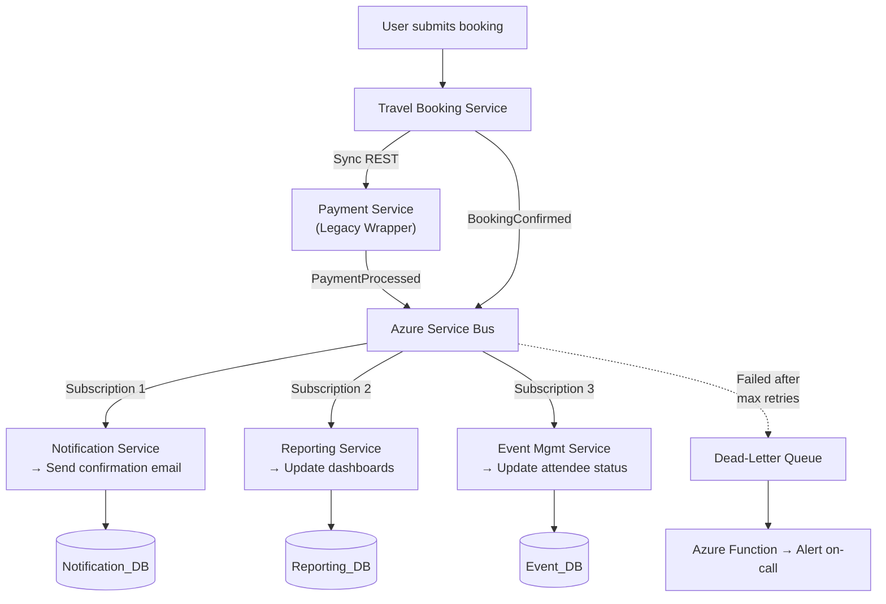
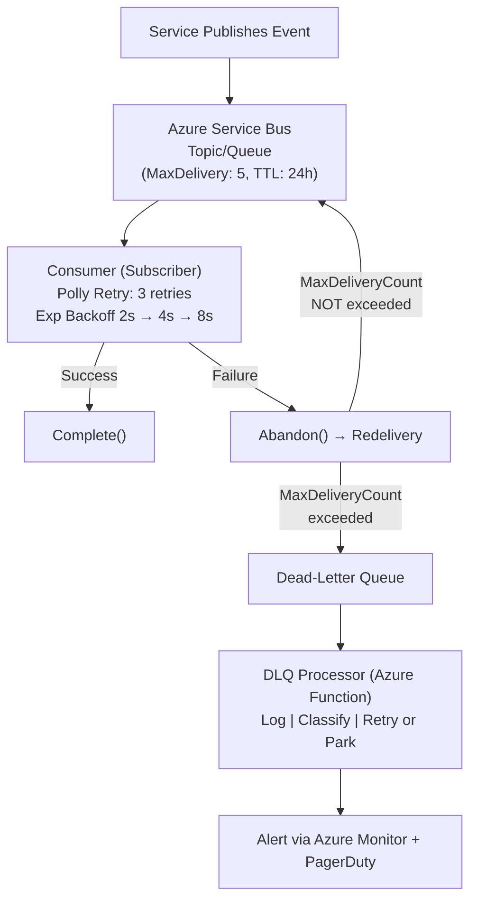
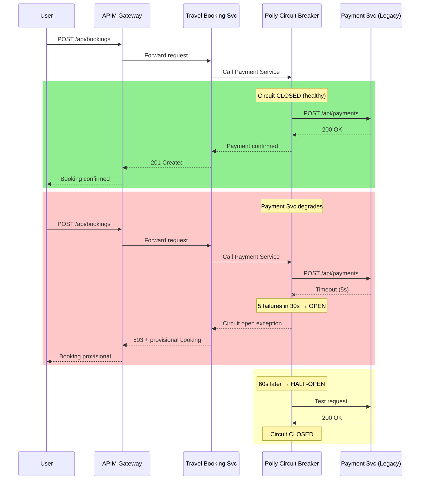

# Technical Assessment – Technical Lead (Azure Microservices)

**Candidate**: Dao Nhan Nguyen (daonhan@gmail.com)
**Date**: 2026-03-21  
**Position**: .NET Technical Lead – Azure Microservices  
**Company**: TravelBookings

---

## 1. Target Architecture Overview

### 1.1 High-Level Architecture Diagram



### 1.2 Proposed Service Boundaries (Bounded Contexts)

| Bounded Context | Service | Responsibility | Data Ownership |
|---|---|---|---|
| **Travel** | Travel Booking Service | Search, booking, itinerary, allocation algorithms, supplier integration | `Travel_DB` – bookings, itineraries, allocations, suppliers |
| **Events** | Event Management Service | Event creation, scheduling, attendee registration, workforce assignment | `Event_DB` – events, schedules, attendees, workforce |
| **Payments** | Payment Service | Payment processing, refunds, reconciliation, digital wallets | `Payment_DB` – transactions, ledger, payment methods *(legacy wrapper in Phase 1)* |
| **Reporting** | Reporting Service | Dashboards, analytics, data aggregation, exports | `Reporting_DB` – materialized views, read replicas, denormalized data |
| **Communications** | Notification Service | Email, SMS, push notifications, centralized comms templates | `Notification_DB` – templates, delivery logs, preferences |

### 1.3 Communication Model (Sync vs Async)



| Pattern | When Used | Technology | Examples |
|---|---|---|---|
| **Synchronous** | User-facing queries needing immediate response | REST / HTTPS via APIM | Get booking details, search events, fetch reports |
| **Async Pub/Sub** | Cross-service state changes; eventual consistency | Azure Service Bus Topics | BookingConfirmed → notification + reporting |
| **Async Command** | Reliable 1:1 task processing | Azure Service Bus Queues | Process allocation, generate report |

### 1.4 How Azure Components Are Used

| Azure Component | Purpose |
|---|---|
| **Azure App Service** | Hosts each .NET 8 microservice; deployment slots for blue/green releases |
| **Azure SQL Database** | Per-service database; elastic pools for cost optimization during transition |
| **Azure Service Bus** | Event-driven messaging backbone – Topics for pub/sub, Queues for commands |
| **Azure API Management** | API Gateway – routing, auth, rate limiting, versioning, legacy façade |
| **Azure Front Door** | Global load balancing, CDN for React SPA, WAF protection |
| **Application Insights** | Distributed tracing, metrics, live monitoring per service |
| **Azure Key Vault** | Secrets management, connection strings, certificates |
| **Azure DevOps** | CI/CD pipelines, IaC deployment (Bicep) |
| **Azure Monitor + Log Analytics** | Centralized logging, alerting, dashboards |

---

## 2. Rationale

### 2.1 Why These Service Boundaries?

1. **Natural domain separation.** Travel, Events, Payments, Reporting, and Communications are distinct business capabilities with different domain experts, change cadences, and regulatory requirements. Payment processing has PCI-DSS compliance needs that benefit from isolation. Reporting has fundamentally different read patterns (heavy aggregation, no writes) versus transactional services.

2. **Team-aligned ownership.** With 5 backend engineers, we need boundaries that allow 1–2 engineers to own a service end-to-end. Five services map well to five engineers, each becoming the domain expert for their context while pairing across boundaries during integration work.

3. **Independent deployability.** Each bounded context can be developed, tested, and deployed independently. The Payment service being wrapped in Phase 1 (constraint: cannot change) does not block Travel or Event modernization.

4. **Data sovereignty.** Each service owns its data, preventing the monolithic database from becoming a distributed bottleneck. The ~600 tables naturally cluster around these domains when analyzed by foreign key relationships and access patterns.

### 2.2 Why This Communication Model?

1. **Sync for reads, Async for writes across boundaries.** User-facing queries demand low latency → synchronous REST. Cross-service state propagation is inherently asynchronous and benefits from temporal decoupling.

2. **Resilience.** If the Notification Service is temporarily down, a `BookingConfirmed` event remains in the Service Bus topic. The booking flow is not blocked. This is critical for the zero-downtime constraint.

3. **Azure Service Bus fit.** Topics/Subscriptions provide pub/sub fan-out. Built-in dead-letter queues, retry policies, and sessions align with enterprise reliability. Unlike Event Hubs (optimized for high-throughput streaming), Service Bus provides transactional messaging semantics matching our domain event patterns.

4. **Avoiding a distributed monolith.** By defaulting to async communication between services, we prevent temporal coupling. Services do not need to know about each other's availability at runtime.

---

## 3. Migration Strategy (Sequenced Plan)

### 3.1 Phased Migration Plan



**Phase 0 — Foundation (Months 1–2):** Establish infrastructure (IaC via Bicep), CI/CD pipelines, the APIM Strangler façade (all traffic routed through APIM → monolith), Application Insights on the monolith, shared NuGet libraries (logging, event contracts, health checks), and the automated test harness. Map ~600 tables to bounded contexts.

**Phase 1 — Reporting Service Extraction (Months 2–4):** Extract the lowest-risk, read-heavy service first. Create `Reporting_DB` with read replicas / CDC from legacy SQL Server. Build the .NET 8 Reporting Service. Progressively switch `/api/reports/*` routes in APIM from monolith → new service via feature flags. Shadow traffic comparison before full cutover.

**Phase 2 — Notification Service + Event Management (Months 3–6):** Introduce event-driven architecture. Build the Notification Service subscribing to Service Bus topics. Extract Event Management (CRUD, scheduling, attendee registration) into its own service with `Event_DB`. Dual-write: monolith publishes events to Service Bus while still writing to legacy DB; new services subscribe with idempotent consumers.

**Phase 3 — Travel Booking Service (Months 5–8):** Migrate the core domain. Build search, booking workflows, itinerary management, allocation algorithms. Integrate with Payment via an Anti-Corruption Layer (thin .NET 8 API wrapping legacy payment module). Extract travel tables (~200) via CDC.

**Phase 4 — Payment Wrapper + Stabilization (Months 7–9):** Wrap (not rewrite) Payment for service isolation — no business logic changes (constraint). End-to-end integration testing. Load testing at ~40,000 user scale. Documentation, runbooks, legacy decommission plan.

### 3.2 Strangler Fig Pattern



From Day 1, all client traffic goes through APIM; initially 100% is proxied to the monolith. As each service is ready, APIM routing rules redirect specific URL paths to the new service. Feature flags (Azure App Configuration) control rollout percentage (5% → 25% → 100%). The monolith never grows — only shrinks.

### 3.3 Backward Compatibility

- **API versioning via APIM:** `Accept-Version` header or URL path versioning (`/v1/`, `/v2/`). Old clients continue hitting v1 routes.
- **Database views as contracts:** When tables move to a new service DB, leave views in the legacy DB pointing to the same data (via CDC sync) during the transition window.
- **Anti-Corruption Layer:** New services do not directly consume legacy schemas. An ACL translates between legacy data models and new domain models.
- **Event schema evolution:** CloudEvents envelope with schema version. Consumers handle multiple versions.

### 3.4 Zero-Downtime Strategy

- **Blue/green deployments:** Azure App Service deployment slots. Swap staging → production with zero downtime.
- **Feature flags:** Azure App Configuration. Toggle routes on/off without redeployment.
- **Online schema migrations:** Expand-and-contract pattern — add new column → backfill → migrate reads → drop old column. Azure SQL online index rebuild.
- **Service Bus buffering:** During service restarts, messages queue in Service Bus. No event loss.
- **Health checks + circuit breakers:** APIM health probes route away from unhealthy instances.

### 3.5 Shared Database During Transition



**Key rule:** Each table has exactly one writer. Multiple readers are fine (via CDC/views). This prevents split-brain data corruption.

---

## 4. Event-Driven Design

### 4.1 Five Core Domain Events

#### 1. BookingConfirmed

```json
{
  "eventId": "uuid-v4",
  "eventType": "BookingConfirmed",
  "eventVersion": "1.0",
  "timestamp": "2025-07-15T10:30:00Z",
  "correlationId": "uuid-v4",
  "source": "travel-booking-service",
  "data": {
    "bookingId": "BK-2025-001234",
    "userId": "USR-98765",
    "travelType": "flight",
    "departureDate": "2025-09-01",
    "returnDate": "2025-09-10",
    "destination": "HCM",
    "totalAmount": 1250.00,
    "currency": "USD",
    "passengers": [
      { "name": "John Doe", "passportNumber": "XX123456" }
    ],
    "paymentReference": "PAY-2025-005678"
  }
}
```

**Subscribers:** Notification Service (confirmation email), Reporting Service (dashboards), Event Management Service (if linked to an event).

#### 2. EventCreated

```json
{
  "eventId": "uuid-v4",
  "eventType": "EventCreated",
  "eventVersion": "1.0",
  "timestamp": "2025-07-15T09:00:00Z",
  "correlationId": "uuid-v4",
  "source": "event-management-service",
  "data": {
    "eventId": "EVT-2025-000456",
    "organizerId": "USR-11111",
    "title": "Global Engineering Summit 2025",
    "location": "Ho Chi Minh City",
    "startDate": "2025-11-01",
    "endDate": "2025-11-03",
    "capacity": 500,
    "status": "draft",
    "categories": ["engineering", "conference"]
  }
}
```

**Subscribers:** Notification Service, Reporting Service, Travel Booking Service (pre-allocate travel options).

#### 3. PaymentProcessed

```json
{
  "eventId": "uuid-v4",
  "eventType": "PaymentProcessed",
  "eventVersion": "1.0",
  "timestamp": "2025-07-15T10:29:55Z",
  "correlationId": "uuid-v4",
  "source": "payment-service",
  "data": {
    "paymentId": "PAY-2025-005678",
    "bookingId": "BK-2025-001234",
    "userId": "USR-98765",
    "amount": 1250.00,
    "currency": "USD",
    "method": "credit_card",
    "status": "completed",
    "gatewayTransactionId": "GW-TXN-XYZ789",
    "processedAt": "2025-07-15T10:29:50Z"
  }
}
```

**Subscribers:** Travel Booking Service (confirm booking), Notification Service (payment receipt), Reporting Service.

#### 4. AttendeeRegistered

```json
{
  "eventId": "uuid-v4",
  "eventType": "AttendeeRegistered",
  "eventVersion": "1.0",
  "timestamp": "2025-07-15T11:00:00Z",
  "correlationId": "uuid-v4",
  "source": "event-management-service",
  "data": {
    "registrationId": "REG-2025-007890",
    "eventId": "EVT-2025-000456",
    "userId": "USR-22222",
    "attendeeName": "Jane Smith",
    "registrationType": "in-person",
    "dietaryRequirements": "vegetarian",
    "sessionPreferences": ["keynote", "workshop-ai"],
    "workforceAssignment": null
  }
}
```

**Subscribers:** Travel Booking Service (auto-create travel booking), Notification Service (confirmation + logistics), Reporting Service.

#### 5. BookingCancelled

```json
{
  "eventId": "uuid-v4",
  "eventType": "BookingCancelled",
  "eventVersion": "1.0",
  "timestamp": "2025-07-15T14:00:00Z",
  "correlationId": "uuid-v4",
  "source": "travel-booking-service",
  "data": {
    "bookingId": "BK-2025-001234",
    "userId": "USR-98765",
    "reason": "schedule_change",
    "cancellationFee": 50.00,
    "refundAmount": 1200.00,
    "currency": "USD",
    "originalPaymentId": "PAY-2025-005678"
  }
}
```

**Subscribers:** Payment Service (initiate refund), Notification Service, Event Management Service (free allocation), Reporting Service.

### 4.2 Event Flow Example — Booking Confirmation



### 4.3 Idempotency Strategy

- **Event-level:** Every event carries a globally unique `eventId` (UUID v4). Consumers store processed IDs in an idempotency table (`ProcessedEvents`). Before processing: `IF EXISTS (SELECT 1 FROM ProcessedEvents WHERE EventId = @eventId) THEN SKIP`.
- **Database-level:** Optimistic concurrency with `RowVersion`/`ETag` on aggregate roots. Duplicate processing fails the concurrency check.
- **Consumer-level:** Azure Service Bus `PeekLock` mode. Message locked during processing; `Complete()` on success; message returns to queue after lock timeout on failure.
- **Natural idempotency:** Design operations to be naturally idempotent. `SET status = 'confirmed'` is idempotent. Avoid `INCREMENT counter` or use compensating logic.

### 4.4 Retry and Dead-Letter Handling



- **Transient errors** (network timeout, 503): Exponential backoff with jitter — 2s, 4s, 8s, max 3 retries.
- **Non-transient errors** (400, deserialization failure): No retry → DLQ immediately.
- **Circuit breaker**: After 5 consecutive failures in 30s, open circuit for 60s.
- **DLQ monitoring**: Azure Function polls DLQ every 5 min → classifies errors → alerts engineer → auto-fix or park.

### 4.5 Message Ordering Considerations

- **Within a single entity:** Use Azure Service Bus Sessions with `SessionId = entityId`. FIFO guaranteed per session.
- **Across entities:** Not guaranteed and not required. Design consumers to handle out-of-order cross-entity messages.
- **Stale event detection:** Each event includes a `timestamp`. Consumers compare against last-processed timestamp for that entity; older events are discarded.

### 4.6 Observability Across Async Flows

- **Distributed tracing:** Every event carries a `correlationId` set at the API gateway. W3C Trace Context (`traceparent`) maps to Service Bus `CorrelationId`.
- **End-to-end view:** Application Insights Application Map shows the full flow across sync and async hops.
- **Structured logging:** Serilog → Application Insights. Every log includes `correlationId`, `eventId`, `serviceId`. Query: `traces | where customDimensions.correlationId == "uuid"`.
- **Message lag monitoring:** Azure Monitor metrics — `ActiveMessageCount`, `DeadLetteredMessageCount`. Alert on thresholds.
- **Custom dashboards:** Azure Monitor Workbooks — processing latency (p50/p95/p99), throughput per topic, DLQ depth.

---

## 5. Risk & Failure Modeling

### Failure Scenario 1: Shared Database Bottleneck During Migration

| Dimension | Detail |
|---|---|
| **Description** | During transition (Phases 1–3), both the monolith and new microservices access the legacy SQL Server. Increased connections, competing locks, and CDC overhead cause query timeouts for ~40,000 users |
| **Likelihood** | **High** |
| **Impact** | **High** — affects all users across all modules simultaneously |
| **Mitigation** | Azure SQL elastic pools for resource allocation; read replicas for reporting immediately; migrate Reporting first (lowest-write); connection pool limits per service; query store to identify regressed queries; single-writer-per-table rule |
| **Telemetry** | DTU/vCore utilization %, query execution time p95/p99, connection pool exhaustion count, lock wait time, deadlock events, CDC latency |

### Failure Scenario 2: Service Bus Message Loss or Consumer Failure

| Dimension | Detail |
|---|---|
| **Description** | Critical domain events (e.g., `PaymentProcessed`) are lost due to consumer crashes before `Complete()`, or messages expire. Bookings stuck in "pending" despite successful payment |
| **Likelihood** | **Medium** |
| **Impact** | **High** — financial impact, user trust erosion, manual reconciliation required |
| **Mitigation** | PeekLock mode; `MaxDeliveryCount = 5`; DLQ monitoring (alert if depth > 0); **outbox pattern** — persist events transactionally, background process publishes; compensating transactions for bookings stuck > 10 min; schema versioning |
| **Telemetry** | `DeadLetteredMessageCount` per topic, `ActiveMessageCount`, consumer processing latency, message age at consumption, outbox pending count, consumer error rate per event type |

### Failure Scenario 3: Cascading Failure via Synchronous Dependencies



| Dimension | Detail |
|---|---|
| **Description** | Travel Service makes a sync call to Payment (legacy wrapper). Payment becomes slow → thread pool exhaustion → cascading 503 errors |
| **Likelihood** | **Medium** |
| **Impact** | **High** — core booking flow completely blocked |
| **Mitigation** | Polly circuit breaker (open after 5 failures/30s); 5s timeout; bulkhead isolation (separate `HttpClient` pool); async fallback via Service Bus queue; graceful degradation with "provisional booking" |
| **Telemetry** | Circuit breaker state changes, HTTP error rate/latency per dependency, thread pool queue length, App Service CPU/memory %, failed dependency calls in Application Insights |

### Failure Scenario 4: Data Inconsistency Between Monolith and Microservices

| Dimension | Detail |
|---|---|
| **Description** | CDC lag or replication failure causes different data between legacy and new databases. Users see different booking statuses depending on which path serves them |
| **Likelihood** | **High** — CDC has inherent latency; intermittent inconsistency is near-certain |
| **Impact** | **Medium** — typically temporary, but visible inconsistencies erode trust; financial reporting discrepancies trigger audit concerns |
| **Mitigation** | Single-writer rule per table; CDC lag alert if > 30s; nightly reconciliation job (count + checksum comparison); feature flags for atomic read cutover (rollback < 1 min); `LastModified` version stamps on all entities |
| **Telemetry** | CDC replication lag, record count delta between databases, feature flag state changes, reconciliation job pass/fail rate, user-reported discrepancy incidents |

### Failure Scenario 5: Deployment Regression Under Production Load

| Dimension | Detail |
|---|---|
| **Description** | A deployment introduces a regression (breaking API change, unhandled exception). With 5 engineers and 9 months, test gaps exist. Regression passes staging but fails under production load |
| **Likelihood** | **Medium** |
| **Impact** | **High** — core booking flow blocked; revenue impact per minute of outage across time zones |
| **Mitigation** | Blue/green via App Service slots (auto-swap back on error spike < 2 min); canary releases (5% traffic for 15 min); contract testing (Pact) in CI; feature flags; Azure Monitor alert on 5xx > 1% triggers automatic rollback |
| **Telemetry** | 5xx error rate per service (real-time), deployment slot swap events, request latency p99 before/after, failed health checks, Application Insights Live Metrics during deployment, smoke test results in pipeline |

---

## 6. Technical Leadership Decisions

### 6.1 What engineering standards would you introduce first?

1. **API Design Standard.** OpenAPI 3.0 specification-first. Consistent naming (kebab-case URLs, camelCase JSON). Standard error envelope: `{ "error": { "code", "message", "traceId" } }`.
2. **Logging & Observability Standard.** Structured logging via Serilog with mandatory fields: `correlationId`, `serviceId`, `userId`, `timestamp`. All logs → Application Insights.
3. **Coding Standards.** `.editorconfig` enforced in CI. Analyzers (SonarAnalyzer, StyleCop) with zero new warnings. Standard Clean Architecture per service (API → Application → Domain → Infrastructure).
4. **Git Workflow.** Trunk-based development with short-lived feature branches. Squash merges. Conventional commits. Branch protection: PR review + passing CI required.
5. **Testing Baseline.** Minimum 80% unit test coverage on domain/application layers (enforced in CI). Integration tests for every endpoint. Contract tests for inter-service communication.

### 6.2 What would you enforce in code reviews?

| Area | Checks |
|---|---|
| **Bounded context integrity** | No direct DB access across service boundaries. No shared domain models. Events only for cross-boundary communication |
| **Error handling** | No swallowed exceptions. All external calls wrapped in Polly retry/circuit breaker. Meaningful error messages with correlation IDs |
| **Idempotency** | Every event handler must be idempotent. Every POST/PUT must handle duplicate submissions |
| **Security** | No secrets in code (Key Vault only). Input validation on all endpoints. SQL parameterization |
| **Performance** | No N+1 queries. Pagination on all list endpoints. Correct async/await (no `.Result` or `.Wait()`) |
| **Observability** | CorrelationId propagation present. Meaningful logs. Custom metrics for critical operations |
| **Test quality** | Tests assert behavior not implementation. No test interdependencies. Mocks only at boundaries |

### 6.3 How would you prevent creation of a distributed monolith?

1. **Async by default.** Synchronous inter-service calls require explicit architectural review. "Can this be an event?" must be answered "no" with justification.
2. **Independent deployability test.** Every sprint, verify each service deploys independently. Coordinated deploys = coupling smell → refactor.
3. **No shared databases.** Enforced from Phase 2. Cross-service data via events or APIs only. Migrations per-service; cannot reference another service's tables.
4. **No shared domain libraries.** Common libraries limited to infrastructure (logging, health checks, event envelope contracts). Business models never shared.
5. **Consumer-Driven Contract Tests.** Pact in CI prevents breaking API changes. Contracts verified independently.
6. **Architecture fitness functions.** Automated CI checks for cross-service imports, dependency graph generation, API call graph monitoring.

### 6.4 What architectural shortcuts are you intentionally accepting?

| Shortcut | Rationale | Future Resolution |
|---|---|---|
| **Payment wrapper, not true microservice** | Constraint: cannot change in Phase 1. Wrapping preserves zero-downtime while isolating behind clean API | Phase 2: Full rewrite with modern gateway, PCI-DSS compliant |
| **App Service instead of AKS** | 5 engineers, 9 months — AKS is unnecessary ops overhead. App Service provides slots, auto-scale, managed TLS | Migrate to AKS if service count > 10 or service mesh needed |
| **Sync REST for Travel → Payment** | Booking confirmation is inherently request/reply. Full saga adds risk in Phase 1 | Implement saga pattern (Durable Functions) post-Phase 1 |
| **CDC-based sync, not event sourcing** | Event sourcing every aggregate from Day 1 is too ambitious for the timeline. CDC is pragmatic and proven | New services adopt event sourcing for own aggregates post-Phase 1 |
| **Monolithic React SPA** | Single SPA with shared design system is sufficient. Micro-frontends add complexity | Decompose into Module Federation if teams grow |
| **Manual DLQ remediation initially** | Automated DLQ processing is complex. Phase 1: alert + manual investigation | Build DLQ processor Azure Function incrementally |

---

## AI Usage Declaration

| Area | Detail |
|---|---|
| **AI tools used** | GitHub Copilot for analysis, structuring, and drafting |
| **Sections AI-assisted** | All sections were drafted with AI assistance for structuring, formatting, and articulating technical patterns. Architectural decisions, technology choices, risk assessments, and phasing strategy reflect real-world Azure microservices modernization experience provided as input judgment |
| **What I manually validated** | Azure service capabilities (App Service deployment slots, Service Bus sessions, CDC support); DDD bounded context decomposition rationale; Strangler Fig pattern applicability; Polly patterns; team sizing realism (5 engineers × 9 months); phase sequencing (lowest-risk first) |
| **How to prevent blind AI usage in a backend team** | 1) **Code review is mandatory** — AI-generated code passes the same review bar as human code. 2) **"Explain your design" culture** — engineers articulate *why* in PRs and design reviews. 3) **Test-first enforcement** — AI-generated code without tests is rejected. 4) **ADRs** — every significant decision documented with context, options, rationale. 5) **Pair programming rotations** — builds the judgment AI cannot replace. 6) **Security scanning in CI** — OWASP, dependency audit on all code regardless of origin |